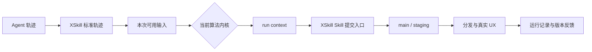

# XSkill 算法内核架构说明

本文说明算法内核抽象层的职责、数据流和安全边界。第一次接入时先阅读
[算法内核开发指南](../examples/kernels/README.md)，按其中的最短路径运行示例并离线生成
Skills。

## 系统边界

算法内核位于“轨迹已经进入 XSkill”与“Skill 进入版本管理和分发”之间。它可以替换轨迹
筛选、聚类、生成和进化算法，但不负责采集用户轨迹，也不能绕过 XSkill 的提交入口直接
修改正式 Skill。



XSkill 负责：

- 收集、脱敏、校验和登记轨迹；
- 选择内核、准备本次输入并记录运行结果；
- 校验 Skill 内容，管理 main、staging、灰度和分发；
- 汇总内核运行信息及其生成 Skill 后续收到的 UX 评价。

算法内核负责：

- 解释自己的配置并调用自己的 package、模型或服务；
- 从本次可用轨迹中选择和处理输入；
- 生成新 Skill，或基于现有版本生成更新；
- 在自己的工作目录中维护缓存和中间结果；
- 返回实际处理的轨迹、提交的 Skills 和无敏感信息的运行指标。

## 调用方式

算法内核只实现一个同步入口：

```python
class MyAlgorithmKernel(BaseKernel):
    metadata = KernelMetadata(...)

    def run(
        self,
        context: KernelContext,
        run_interval: int = 30,
    ) -> KernelRunResult:
        ...
```

定时任务、轨迹变化和手动调用由 `context.invocation.trigger` 区分，同一算法不需要为每种
方式分别实现回调。线上外部 Kernel 由独立常驻进程复用，并按 `run_interval` 默认值周期
调用；Native Kernel 仍由 XSkill worker 驱动。`xskill distill` 只调用一次，不使用该间隔。
内核在返回前完成本次工作；异常由 XSkill 记录为失败运行。

## 发现和目录

默认目录为：

```text
~/.xskill/kernels/<kernel-id>/
├── kernel.py
├── config.yaml
└── workspace/
```

`kernel.py` 导出 `KERNEL_CLASS: type[BaseKernel]`，目录名与 `KernelMetadata.id` 一致。
导入算法依赖失败时，该内核会显示为不可用，不影响其他内核。

用户级配置使用 `kernel.kernels_path` 和 `kernel.kernel_id` 选择目录及内核。旧字段
`plugin_dir`、`active` 继续兼容，但新旧字段不能设置为冲突值。

每个算法内核自行维护并读取自己的 `config.yaml`，XSkill 只提供文件路径。`workspace/`
由算法保存缓存、中间索引和临时结果。

## Context 提供的对象

`KernelContext` 在每次运行中提供：

- `trajectory_root`：本次输入的绝对文件系统根，Kernel 可交给自己的扫描器、命令行工具或
  dataloader；Team Server 默认是 `~/.xskill/team_trajectories/clients`，手动 distill
  时是用户指定的 `--trajectory-dir`。该根只表示平台轨迹输入（`traj_*.md` 及 sidecar），
  不是任意 benchmark 目录；算法自有评测集放在 `workspace`。
- `trajectories`：读取单条轨迹及其子轨迹（atom）视图，或取得本次可扫描的目录。轨迹对象
  提供 Markdown 原文、`source`（`user` / `temp`）、`atom_split_status`（`pending` /
  `ready` / `updated`），以及 atom 的 `content` 字段；**不提供轨迹级 UX**；体验分在 atom
  的 `ux_score`（`1..10` 或 `None`）以及 Skill 版本评价上。Kernel 可通过
  `trajectories.create_temp(...)` 写入 workspace 下临时轨迹；`changed_trajectory_ids`
  只 feed `ready` 轨迹，算法用 `atom_id` 去重。
- `skills`：只读现有 Skill、main/staging 提交和各版本 UX；
- `publisher`：新建 Skill 或提交已有 Skill 的新版本；
- `workspace`：算法可写的工作目录（含自有数据集与缓存）；
- `config_path`：算法配置路径；
- `xskill_config_path`：用户级 XSkill 配置的绝对路径；
- `llm`：按用户配置创建并在外部 Kernel 进程内统一执行 RPM、TPM、burst 和最大并发限制
  的 LLM 客户端；
- `embedding`：按用户配置创建并限制最大并发的 Embedding 客户端；
- `invocation`：触发方式、输入集合指纹（`dataset_id`）和变化轨迹提示；
- `run_id`：本次运行 ID。

提交入口会校验 Skill 名称、元数据、文件路径、文本编码和更新依据。新 Skill 直接创建 main；
已有 Skill 的更新进入 staging，正式版本在观察期间保持不变。

`trajectories` 对平台登记的多个 watch-dir 逐一读取，并递归兼容其下的 `traj_*.md`。当调用方
只有一个手动输入根、没有 Registry 记录时，也会从 `trajectory_root` 递归构造资源。Kernel
不应假设根目录下一层就是 Markdown，也不应假设只有一个 client 或 watch-dir。

XSkill 的跨平台稳定输入是标准化、脱敏后的 Markdown。邻接 `.json` 只是可选 sidecar，不能
作为“服务器一定保存了原始轨迹”的承诺；Team Server 正常上传目前只传 Markdown 和有限的
model/harness 元数据。

## 离线生成与线上反馈

`xskill distill --kernel ... --trajectory-dir ... --output ...` 将指定目录中的标准轨迹复制
到独立输入目录，使用独立的工作空间、注册表和 Skill 目录运行内核；同时把用户指定目录的
绝对路径作为 `context.trajectory_root` 暴露给 Kernel（平台轨迹输入根）。算法自有评测或
附件应使用 `context.workspace`，不要把 benchmark 根目录冒充轨迹输入。`--output` 必须显式
提供，离线 `context.workspace` 固定为 `<output>/.xskill/workspace/`。产物包含输入清单、
运行状态、耗时、处理量、生成的 Skills 和算法返回的运行指标。这个命令不启动服务、不切换
线上当前内核，也不产生算法能力分。

线上每次运行都记录内核 ID 和算法版本。内核生成的 Skill 投入使用后，UX 评价绑定到具体
Skill 提交版本，灰度流程再记录晋升、拒绝或超时。Dashboard 导出的当前内核报告同时包含
运行明细、版本级 UX 和灰度结果。算法自己返回的 `metrics` 只作为运行信息，不能代替用户
评价。

新增和更新都调用 `publisher.submit()`。更新时，Kernel 先读取目标 Skill 当前的
`main_commit_sha`，再作为 `base_commit_sha` 提交；Publisher 用它进行并发校验并把候选版本
送入 staging。`KernelRunResult` 只记录运行回报，本身不会修改 Skill。

## 安全边界

线上外部算法内核在 XSkill 管理的独立常驻进程中加载，但不是操作系统沙箱：算法代码仍以
XSkill 所在账号运行。生产环境只安装经过审查的内核和依赖；未知代码需要放入独立容器或
服务。

标准离线产物不会复制算法的 `config.yaml`，返回的嵌套指标会按敏感字段名脱敏。算法仍需
避免把密钥、用户正文和个人信息写入 `metrics`、`notes`、日志或需要交付的工作空间文件。

## 后续可扩展边界

在保持 `run(context)` 和 Context 对象用法不变的前提下，可以继续增加：

- 容器或远程服务执行器；
- CPU、内存、网络与超时限制；
- 更细的输入授权和数据访问记录；
- 内核 package 的签名、发布与兼容性检查。

真实 SDK 适配参考 [SkillOpt 示例](../examples/kernels/skillopt/kernel.py)，可直接运行的模板
参考 [your-demo-algo-kernel](../examples/kernels/your-demo-algo-kernel/kernel.py)。完整对象
与操作说明位于项目级
[xskill-kernel Agent Skill](../examples/kernels/.agents/skills/xskill-kernel/SKILL.md)。
