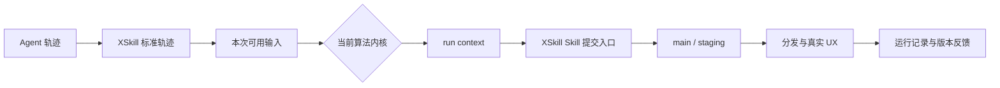

# XSkill 算法内核架构说明

本文说明算法内核抽象层的职责、数据流和安全边界。第一次接入时先阅读
[算法内核开发指南](../examples/kernels/README.md)，按其中的最短路径运行示例并离线生成
Skills。

## 系统边界

算法内核位于“轨迹已经进入 XSkill”与“Skill 进入版本管理和分发”之间。它可以替换轨迹
筛选、聚类、生成和进化算法，但不负责采集用户轨迹，也不能绕过 XSkill 的提交入口直接
修改正式 Skill。



XSkill 负责：

- 收集、脱敏、校验和登记轨迹；
- 选择内核、准备本次输入并记录运行结果；
- 校验 Skill 内容，管理 main、staging、灰度和分发；
- 汇总内核运行信息及其生成 Skill 后续收到的 UX 评价。

算法内核负责：

- 解释自己的配置并调用自己的 package、模型或服务；
- 从本次可用轨迹中选择和处理输入；
- 生成新 Skill，或基于现有版本生成更新；
- 在自己的工作目录中维护缓存和中间结果；
- 返回实际处理的轨迹、提交的 Skills 和无敏感信息的运行指标。

## 调用方式

算法内核只实现一个同步入口：

```python
class MyAlgorithmKernel(BaseKernel):
    metadata = KernelMetadata(...)

    def run(self, context: KernelContext) -> KernelRunResult:
        ...
```

定时任务、轨迹变化和手动调用由 `context.invocation.trigger` 区分，同一算法不需要为每种
方式分别实现回调。内核在返回前完成本次工作；异常由 XSkill 记录为失败运行。

## 发现和目录

默认目录为：

```text
~/.xskill/kernels/<kernel-id>/
├── kernel.py
├── config.yaml
└── workspace/
```

`kernel.py` 导出 `KERNEL_CLASS: type[BaseKernel]`，目录名与 `KernelMetadata.id` 一致。
导入算法依赖失败时，该内核会显示为不可用，不影响其他内核。

每个算法内核自行维护并读取自己的 `config.yaml`，XSkill 只提供文件路径。`workspace/`
由算法保存缓存、中间索引和临时结果。

## Context 提供的对象

`KernelContext` 在每次运行中提供：

- `trajectories`：读取单条轨迹，或取得本次可扫描的目录；
- `skills`：读取完整 Skill、main/staging 提交和各版本 UX，并在工作目录创建可编辑副本；
- `publisher`：新建 Skill 或提交已有 Skill 的新版本；
- `workspace`：算法可写的工作目录；
- `config_path`：算法配置路径；
- `invocation`：触发方式、输入集合 ID 和变化轨迹提示；
- `run_id`：本次运行 ID。

提交入口会校验 Skill 名称、元数据、文件路径、文本编码和更新依据。新 Skill 直接创建 main；
已有 Skill 的更新进入 staging，正式版本在观察期间保持不变。

## 离线生成与线上反馈

`xskill distill --kernel ... --trajectory-dir ...` 将指定目录中的全部轨迹复制到独立输入
目录，使用独立的工作空间、注册表和 Skill 目录运行内核。产物包含输入清单、运行状态、耗时、
处理量、生成的 Skills 和算法返回的运行指标。这个命令不启动服务、不切换线上当前内核，也
不产生算法能力分。

线上每次运行都记录内核 ID 和算法版本。内核生成的 Skill 投入使用后，UX 评价绑定到具体
Skill 提交版本，灰度流程再记录晋升、拒绝或超时。Dashboard 导出的当前内核报告同时包含
运行明细、版本级 UX 和灰度结果。算法自己返回的 `metrics` 只作为运行信息，不能代替用户
评价。

## 安全边界

算法内核是 XSkill 进程内加载的可信 Python 插件，不是操作系统沙箱：算法代码与 XSkill
使用同一账号权限。生产环境只安装经过审查的内核和依赖；未知代码需要放入独立容器或服务。

标准离线产物不会复制算法的 `config.yaml`，返回的嵌套指标会按敏感字段名脱敏。算法仍需
避免把密钥、用户正文和个人信息写入 `metrics`、`notes`、日志或需要交付的工作空间文件。

## 后续可扩展边界

在保持 `run(context)` 和 Context 对象用法不变的前提下，可以继续增加：

- 子进程、容器或远程服务执行器；
- CPU、内存、网络与超时限制；
- 更细的输入授权和数据访问记录；
- 内核 package 的签名、发布与兼容性检查。

真实 SDK 适配参考 [SkillOpt 示例](../examples/kernels/skillopt/kernel.py)，可直接运行的模板
参考 [your-demo-algo-kernel](../examples/kernels/your-demo-algo-kernel/kernel.py)。完整对象
与操作说明位于项目级
[xskill-kernel Agent Skill](../examples/kernels/.agents/skills/xskill-kernel/SKILL.md)。
