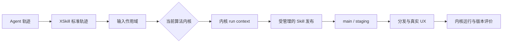

# XSkill 算法内核架构说明

本文说明算法内核抽象层的职责、数据流和安全边界。第一次接入时请先阅读
[算法内核开发指南](../examples/kernels/README.md)，按其中的最短路径运行示例和数据集评测。

## 系统边界

算法内核位于“轨迹已经进入 XSkill”与“Skill 进入版本管理和分发”之间。它可以替换轨迹
筛选、聚类、生成和进化算法，但不负责采集用户轨迹，也不能绕过受管理的发布入口直接修改
正式 Skill。



XSkill 负责：

- 收集、脱敏、校验和登记轨迹；
- 选择内核、构造输入作用域并记录运行结果；
- 校验 Skill 内容并管理 main、staging、灰度和分发；
- 汇总内核运行指标与内核产出 Skill 的后续 UX。

算法内核负责：

- 解释自己的配置并调用自己的 package、模型或服务；
- 从允许访问的轨迹中选择和处理输入；
- 生成新 Skill，或基于现有版本生成更新候选；
- 维护游标、缓存和中间产物，并保证重试幂等；
- 返回真实的处理范围、产出和非敏感诊断指标。

## 稳定调用接口

算法内核只实现一个同步入口：

```python
class MyAlgorithmKernel(BaseKernel):
    metadata = KernelMetadata(...)

    def run(self, context: KernelContext) -> KernelRunResult:
        ...
```

调度周期、轨迹变化、手动调用和数据集评测属于调用原因，由
`context.invocation.trigger` 表示。同一算法无需为每种驱动方式实现一套回调。内核在返回前
完成本次有界工作；异常由调用方记录为失败运行。

## 发现与所有权

默认目录为：

```text
~/.xskill/kernels/<kernel-id>/
├── kernel.py
├── config.yaml
└── workspace/
```

`kernel.py` 导出 `KERNEL_CLASS: type[BaseKernel]`，目录名与 `KernelMetadata.id` 一致。
导入算法依赖失败时，该内核会显示为不可用，不影响其他内核。

XSkill 只把 `config.yaml` 路径交给内核，不解释其中字段。算法提供方拥有配置格式、默认值、
迁移、密钥和模型端点。`workspace/` 同样归算法提供方使用，适合保存游标、中间索引、缓存和
算法日志。

## 能力对象

`KernelContext` 按一次运行提供以下能力：

- `trajectories`：读取单条标准轨迹，或获取允许扫描的只读目录；
- `skills`：读取完整 Skill、main/staging 提交和版本级 UX，并创建工作区副本；
- `publisher`：新建 Skill 或提交已有 Skill 的更新候选；
- `workspace`：算法可写的状态目录；
- `config_path`：算法私有配置路径；
- `invocation`：运行 ID、触发方式、数据集身份和变化输入提示。

发布入口会校验 Skill 名称、元数据、文件路径、文本编码和更新基线。新 Skill 创建 main；
已有 Skill 的更新进入 staging，正式版本在真实评价期间保持不变。

## 离线与线上评价

数据集评测通过 `xskill eval --kernel ... --dataset ...` 在隔离的输入、工作空间和 Skill
目录中执行，输出输入清单、运行状态、耗时、处理量、产出和算法诊断指标。它适合验证协议、
稳定性和幂等，但不自行产生质量分。开发环境可另传 `--benchmark <benchmark.json>`，在内核
完成后把隔离生成的 Skills 交给算法提供方的外部评价器。XSkill 不理解评价器的数据和私有
配置，只执行显式命令并校验标准化的 dataset、split、score、passed、total 与 source。

线上评价将每次运行归因到内核 ID 和算法版本，并将已发布 Skill 的 UX 绑定到具体提交。
Dashboard 的导出报告同时包含运行明细、版本级 UX 原始事件和灰度决定。算法优劣应基于
统一观察窗口、足够样本和多项指标判断，不能把算法自报指标当成独立质量分。

评价脚本、数据集、模型、密钥和评分协议继续由算法提供方拥有。严格的保密测试集、公平资源
限额和正式跨内核排行榜应由独立评测环境负责，当前进程内的轨迹数据集执行不提供这种隔离
保证。

## 安全边界

算法内核是可信的进程内 Python 插件。公共对象建立了清晰的读写合同，但不是操作系统安全
沙箱：算法代码与 XSkill 使用同一账号权限。生产环境只应安装经过审查的内核和依赖，并将
未知算法放入独立容器或服务中运行。

私有配置不会复制进标准离线评测产物，返回的嵌套指标会按敏感字段名脱敏。算法自身仍须
避免把密钥、用户正文和个人信息写入 `metrics`、`notes`、日志或工作空间交付物。

## 演进边界

以下能力可以在保持 `run(context)` 与能力对象语义不变的前提下扩展：

- 子进程、容器或远程服务执行器；
- CPU、内存、网络与超时限制；
- 更多独立 benchmark 驱动和正式排行榜；
- 更细的输入授权和可审计的数据访问；
- 内核 package 的签名、发布与兼容性检查。

真实 SDK 适配参考 [SkillOpt 示例](../examples/kernels/skillopt/kernel.py)，可直接运行的协议
模板参考 [your-demo-algo-kernel](../examples/kernels/your-demo-algo-kernel/kernel.py)。
