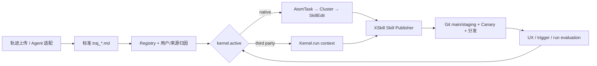

# XSkill 算法内核抽象层

第一次接入算法内核时，请先阅读[算法内核开发者 README](../examples/kernels/README.md)。
本文解释架构和职责边界；开发者 README 提供目录布局、公共对象、轨迹读取、Skill 提交、
评价、测试和版本发布的完整操作步骤。

## 结论

内核的替换边界是「标准轨迹已经由 XSkill 收集、清洗、归因和登记」之后，「正式
Skill 进入 Git / Canary / 分发」之前。内核可以自由选择拆分、聚类、生成和进化算法，
但不能绕开 XSkill 的 Publisher 直接写 Skill 库。



XSkill 负责：

- 轨迹上传、生态适配、脱敏、输入校验和 Registry；
- 调度、超时（后续子进程化）、运行审计和算法评价；
- Skill 路径/frontmatter 校验、Git 提交、main/staging、Canary 和分发。

算法内核负责：

- 从标准轨迹中选择输入；
- 用自己的 SDK、模型、benchmark 和配置执行拆分/聚类/生成/进化；
- 通过 `context.publisher.submit(...)` 提交 Skill draft；
- 返回可审计的输入、输出和自定义指标。

## 为什么不使用 `handle_trajectory_change` / `handle_time`

事件、定时、手动和离线评测都是「驱动方式」，不是算法接口本身。V2 只保留一个入口：

```python
class MyKernel(BaseKernel):
    manifest = KernelManifest(...)

    def run(self, context: KernelContext) -> KernelRunResult:
        ...
```

`context.invocation.trigger` 可以是 `scheduled` / `trajectory_changed` / `manual` /
`evaluation`。Invocation 身份收进 Context，避免 provider 面对一个常常不用的第二参数。
因此同一内核不需要为不同驱动方式实现多套回调。当前 daemon 使用 `scheduled`，后续可以
在不改内核协议的前提下增加手动运行和独立 benchmark runner。

## 目录、配置与发现

XSkill 主配置只保存选择器和插件目录：

```yaml
kernel:
  active: native
  plugin_dir: ~/.xskill/kernels
```

本地 bridge 的约定布局：

```text
~/.xskill/kernels/openearth/
├── kernel.py          # 导入 openearth 包，导出 KERNEL_CLASS
├── config.yaml       # openearth 自己读写，XSkill 不解析
└── workspace/        # 持久 cursor/cache/benchmark 产物
```

一个 bridge 必须导出 `KERNEL_CLASS: type[BaseKernel]`。目录名必须与
`KERNEL_CLASS.manifest.id` 一致。bridge 的 import 错误会在面板显示为「不可用」，不会
影响其他内核。

V2 demo 使用本地 bridge，正式插件发布建议再增加 Python package entry point
`xskill.kernels`，但保持相同的 `BaseKernel` 协议和工作空间布局。

## Context 能力

`KernelContext` 是任务级对象：

- `workspace`：该内核的持久工作空间；
- `config_path`：内核私有配置路径，是 opaque path；
- `trajectories.iter/list/get`：标准轨迹、meta、来源和 Registry 状态的只读视图；
- `trajectories.directories`：允许内核直接使用 `rg`、`find`、DuckDB 等批量工具；
- `skills.list/get/checkout`：读取完整 Skill bundle、Git 版本和版本级 UX；
- `publisher.submit/submit_checkout`：唯一写入口。新 Skill 进 main，同名更新进 staging。

不暴露可写 `Registry connection`、`TrajDB`、`SkillDB` 或 skill 根目录。但需注意：
V2 是进程内 Python 插件，这是 API 边界，不是安全沙箱。只应加载可信代码。轨迹目录的
只读属性目前是合同；严格 benchmark 需要子进程/容器只读 mount。

## 评价口径

`~/.xskill/kernel_runs.db` 保存：

- `run_id / kernel_id / kernel_version / trigger / dataset_id`；
- 成功/失败、耗时、输入数、输出数、输出 Skill 和错误；
- 内核返回的 `metrics` JSON。

面板同时按 `metadata.kernel.id` 归属已发布 Skill，汇总它们的后续 UX。旧 Skill 没有
内核标记时归为 `native`。

这些是「生产运行 + 延迟用户反馈」，不是严格离线 benchmark。`xskill eval <kernel>
<dataset>` 提供隔离 Registry/Skill/workspace、确定性抽样、进度表和标准 artifacts，但只衡量
contract/运行健康，不把 provider 自报 metrics 冒充质量分。公平比较两个内核时，
必须让它们使用相同 `dataset_id`、隔离的输出 Skill repo 和固定评测器。这应该是下一阶段
Xarena benchmark backend 的责任，不应让两个内核同时写生产 Skill 库。

## 运行 demo

`starter` 不需要 LLM，但只处理 `.md.meta` 中显式带有
`{"kernel_demo": true}` 的轨迹。无需切换生产内核即可运行：

```bash
xskill eval starter examples/kernels/datasets/micro-trajectories \
  --sample 1/4 --plugin-dir examples/kernels
```

真实 SDK 接入参见 [SkillOpt bridge](../examples/kernels/skillopt/kernel.py)。
