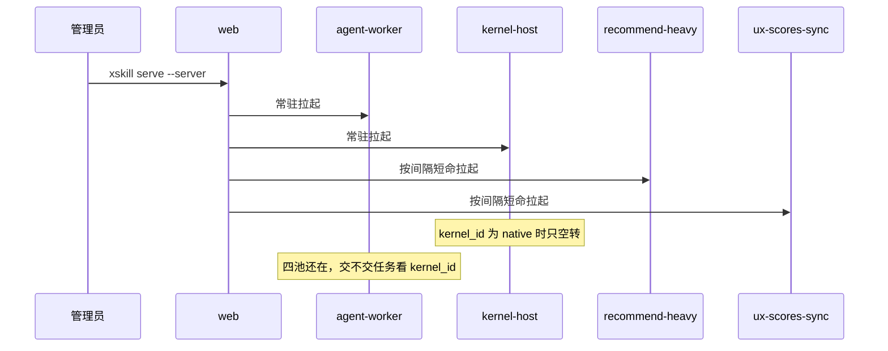
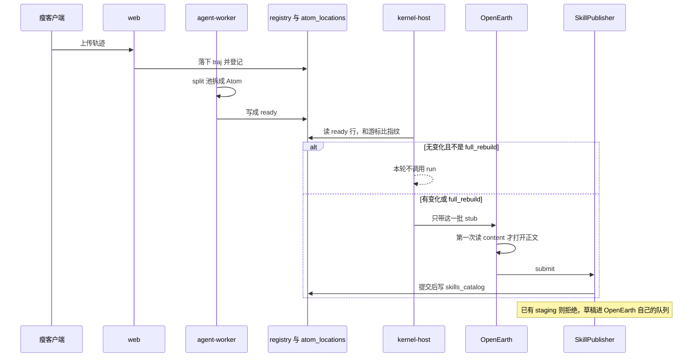
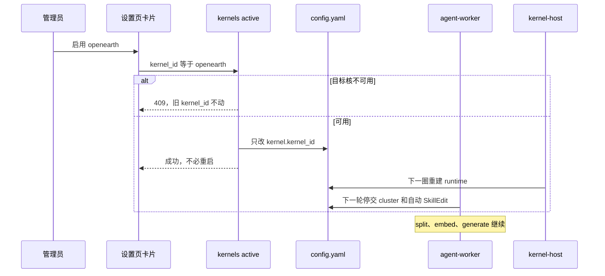
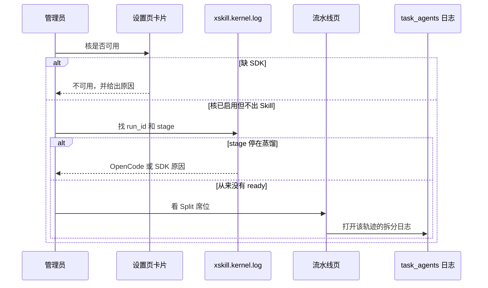
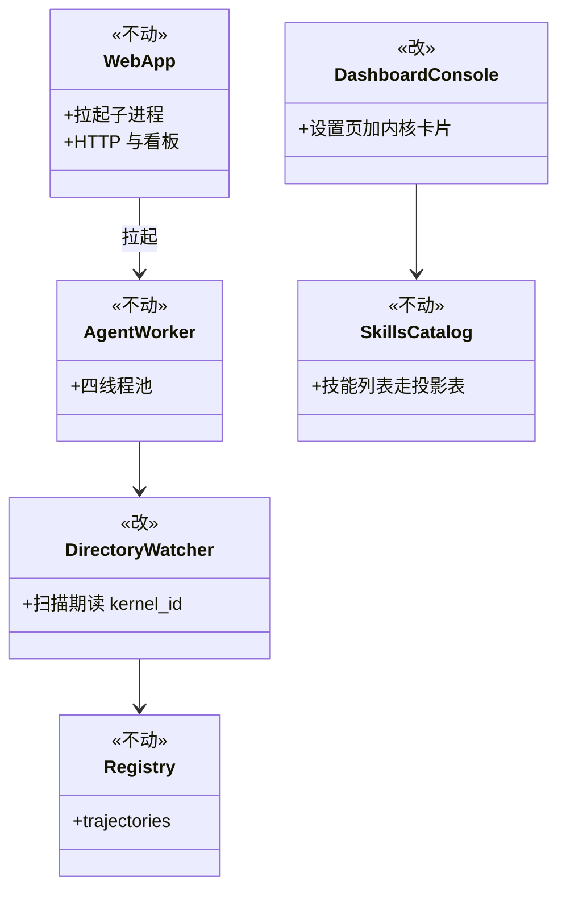
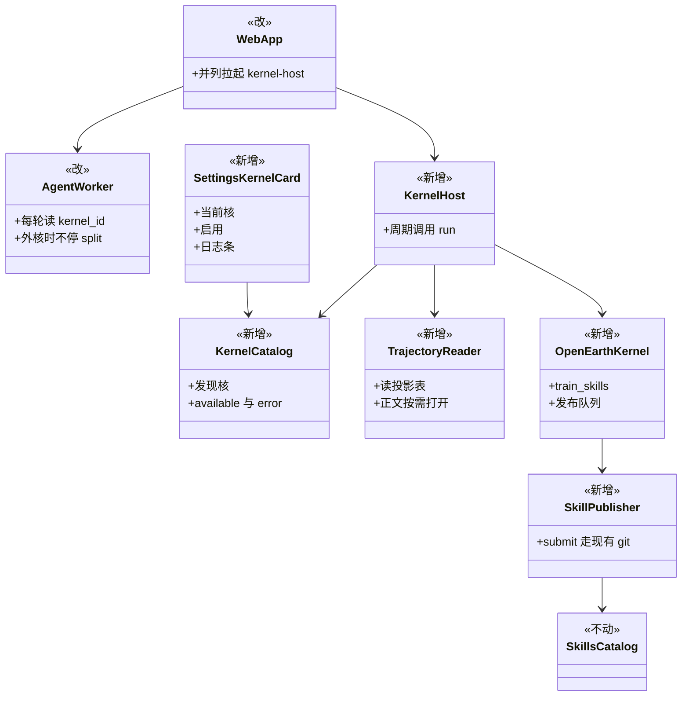

# 把算法内核与 OpenEarth 接到当前主干

对应 [issue #363](https://github.com/SkillNerds/xskill/issues/363)、[PR #364](https://github.com/SkillNerds/xskill/pull/364)。不要 rebase [PR #155](https://github.com/SkillNerds/xskill/pull/155)。按当前主干加 kernel-host，设置页换核，喂数走数据库。换核闭环对齐 [#205](https://github.com/SkillNerds/xskill/issues/205)。

名词只在这里解释一次。算法内核：轨迹进站之后、Skill 发布之前可替换的那一层。Native Kernel：平台自带，id 为 `native`，真正干活的是拆分、归类、编辑三个代理。OpenEarth：第三方核，id 为 `openearth`。Atom：一条轨迹拆出来的原子任务。kernel-host：周期调用外部核 `run()` 的常驻子进程。agent-worker：主干上已有的常驻四池子进程。baby、staging、main：技能的预备分支、灰度分支、正式主干。

打开本页请先看图。图下各有一句说明。细节在后面。

## 时序图

### 1. 启动后有哪些进程

合入后只多一条 kernel-host。Native 被选中时它空转。选 OpenEarth 时它按间隔调用 `run()`。

### 2. 一条轨迹怎么变成 OpenEarth 的 Skill

拆分仍由 agent-worker 做。kernel-host 只读数据库里已经 ready 的行。没有变化就不要调用 `run()`。

### 3. 管理员在设置页换核

只改 `kernel.kernel_id`。不必重启 serve。坏核被拒绝，旧核继续工作。

### 4. 出了问题看哪里

先看设置页。再看 `xskill.kernel.log`。拆分失败才去流水线页。

## 类图

标注：新增、改、不动。不要从旧分支整文件覆盖主干上已经演进的模块。

### Before（当前主干）

没有 `src/xskill/kernels/`。轨迹到 Skill 由 agent-worker 里的拆分、归类、编辑完成。

### After（合入后）

选 OpenEarth 之后：split、embed、generate 继续。cluster 和自动 SkillEdit 必须停，否则归类代理会造 baby 占坑，OpenEarth 再发同名技能会崩。不要把整个 edit 池人数调成 0，generate 会一起死。

不动的模块：atom 向量索引、`tasks.projection`、`skill.catalog_store`、`recommend`、流水线页读状态文件的契约、canary、llm 限流、`skill.git`、`pyproject.toml` 里已有的可选依赖。

平台契约从最新 `feat/algorithm-kernel-demo` 搬（含 #153、#291），不要用 #155 里那份仍在 `rglob` 的旧 `context.py`。OpenEarth 行为留在 `examples/kernels/openearth/kernel.py`。平台 Publisher 仍是「已有 staging 就拒绝」，排队是 adapter 的事。

## 用户怎么用

给装 team server 的管理员。team 客户端不读 server 的 `config.yaml`。

1. 在同一 Python 环境按 OpenEarth README 安装 wheel。
2. 把 `examples/kernels/openearth` 拷到 `~/.xskill/kernels/openearth`。目录名必须与 id 一致。
3. 核目录里的 `config.yaml` 只填 OpenCode。平台不读这份私有配置。
4. 平台配置写 `kernel.kernel_id: openearth`，或在设置页点启用。旧字段 `active`、`plugin_dir` 不能和新字段冲突。
5. 切核不必重启 serve。本轮 `run()` 不中途热替换。

`xskill distill --kernel` 是离线命令，不当线上换核。`xskill generate` 与换核无关，继续走 edit 池。

设置页只加一张「算法内核」卡片，不要新开一级导航。总览最多一行只读当前核。流水线页：拆分栏继续有活，归类和自动编辑必须写成已停。技能库里，新建走 main，更新走 staging。还在核队列里的草稿看 `~/.xskill/kernels/openearth/workspace/openearth-publication-queue.json`。默认不要开 benchmark。

## 数据从哪读

不要为了数字或喂核去扫 `traj_*.md`、`SKILL.md`。agent-worker 拆完写 `trajectories` 和 `atom_locations`。发布后写 `skills_catalog`。ux-scores-sync 把打分推进 `ux_scores`。kernel-host 读这些表算变化，只对变化的轨迹打开正文。`changed` 为空且不是 `full_rebuild` 时，本轮不训练。

kernel-demo 的 `TrajectoryReader.iter()` 每一轮把全库正文读进内存，这是合入后最大的性能债。增量样板抄 `atom_vector_index._reconcile_changed_trajs`，不要抄 demo 的全库物化。#291 的平铺扫描只是不再递归，不能当成已经够快。

红线：看板总览和技能列表热路径不打开原始文件。kernel-host 无变化轮次不读全库 atom JSON。OpenEarth 不扫 `team_trajectories`，不把空 changed 当成全量。不要在 web 进程里跑 OpenEarth。

## 四块怎么合

1. 平台契约接到主干。搬最新 demo 的 `src/xskill/kernels/`。`_workers.py` 增加 `kernel-host`。agent-worker 扫描期开关：外核时仍拆分，不 cluster，不自动 SkillEdit。`TrajectoryReader` 改读投影。#176 的临时轨迹一起做或紧随。
2. OpenEarth adapter。保留 #155 的 full_rebuild 三分支、staging 排队、多 atom oracle。Gate 关闭。
3. 设置页卡片和日志。对齐 #205。`POST /admin/kernels/active`。日志条挂在卡片下方。流水线页只加「外核已停」。
4. wheel 和 README。只留当前一份。

## 不要做

不要 rebase 整条 #155。不要把短命 sweep 搬回来。不要设置页代装 pip。不要新开「算法内核」导航。不要把 OpenEarth 字段抬进平台 yaml。不要用 distill 当线上换核。不要把 generate 理解成换核。不要停掉整个 edit 池。不要让 ClusterAgent 再造 baby stub。不要为了看板有数去扫盘。不要在 web 里跑 OpenEarth。不要把空 changed 当成全量训练。不要把本机 Docker 或 `hub.xskill.wiki` 写成现网。

## 怎么算做完

设置页能看到 OpenEarth。缺 SDK 不能启用，旧核仍工作。切核后 `kernel_id` 变成 `openearth`，`xskill.kernel.log` 有记录。拆分仍在跑，归类和自动编辑显式已停，generate 仍能排队。技能库出现 OpenEarth 提交的 main 或 staging。serve 之后有 kernel-host，Native 时空转。父子 Registry 同一物理 traj 只暴露一次。`create_temp` 能变成 ready Atom。invocation 三分支成立。看板热路径不打开 `traj_*.md`。无变化轮次不调用 `train_skills`。

## 明确以后再说

容器沙箱、内核包签名、Dashboard 代装 pip、总览内核运行大表、`xskill kernel list/use`、总览 `avg_ux` 切到 `ux_scores` 表、标签云投影表。现网要等四块合进主干并升级 server 之后，由用户在现网侧验收。本机 Docker 和 `hub.xskill.wiki` 都不是现网。
