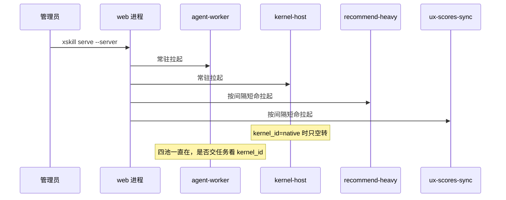
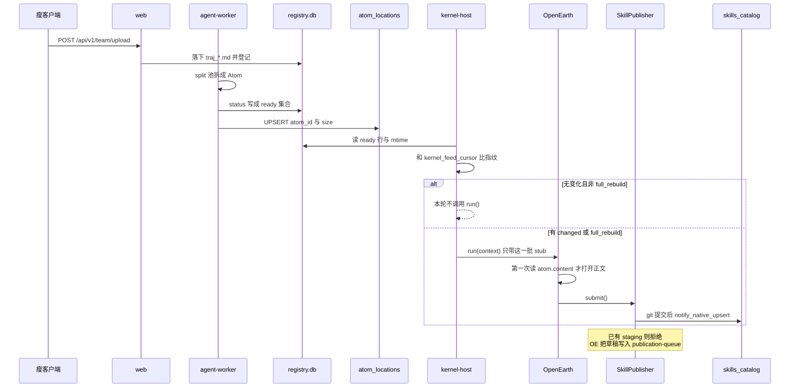
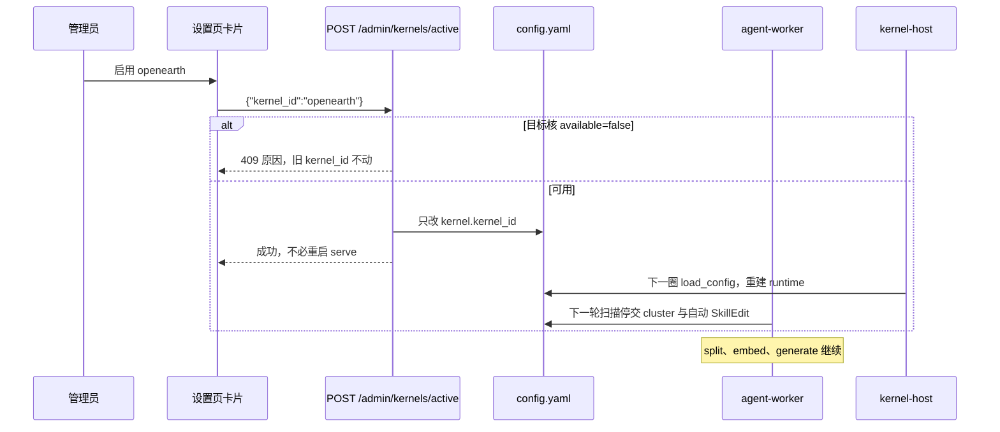
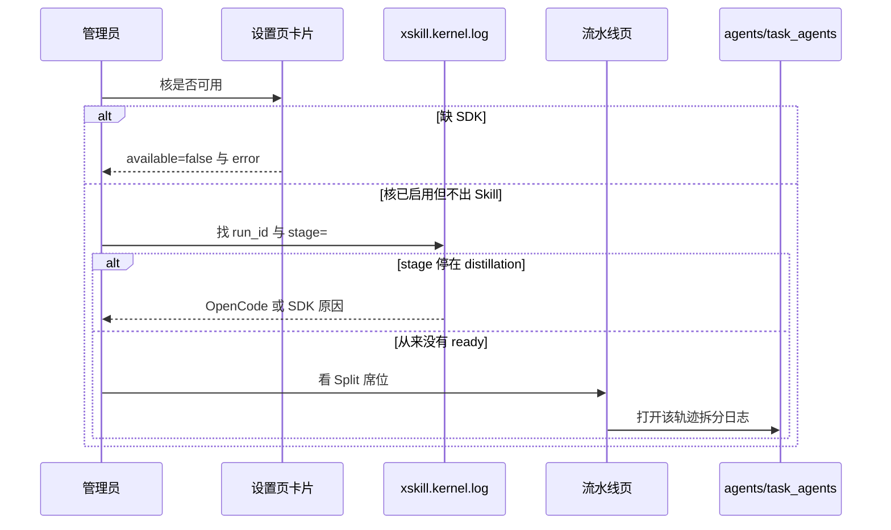
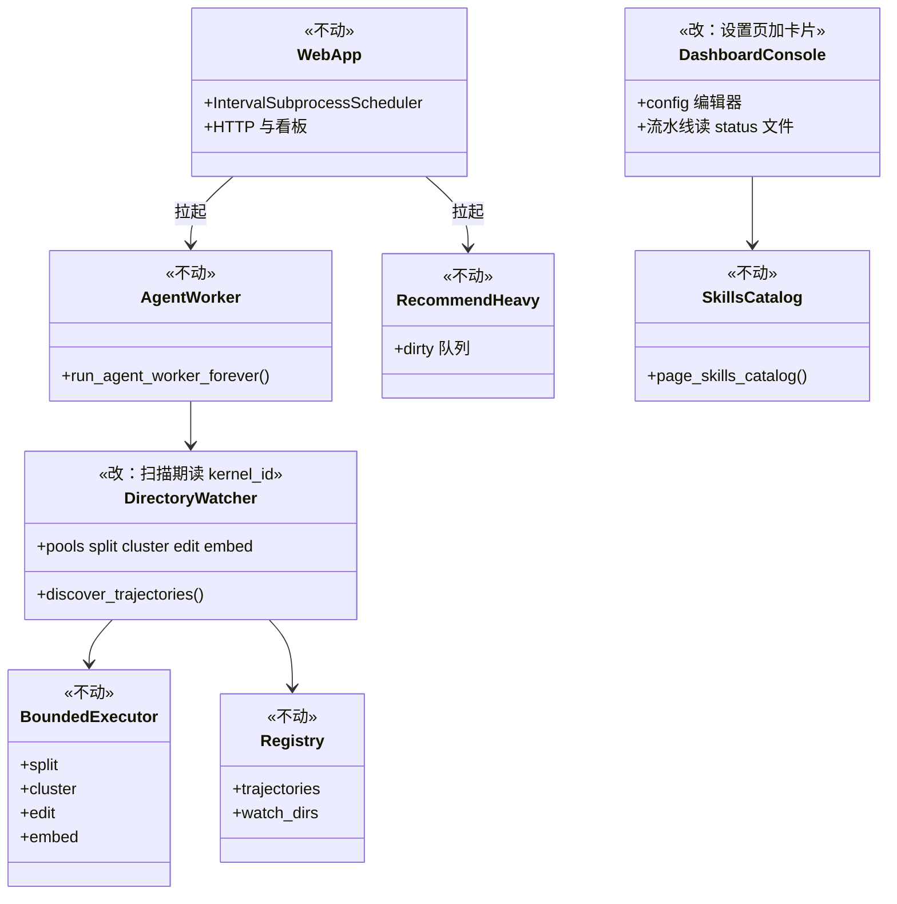
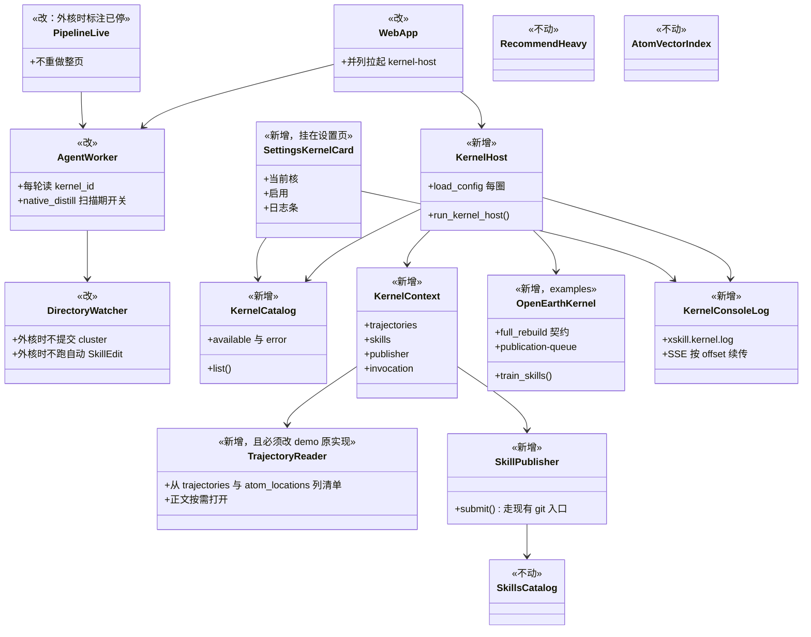

# 把算法内核与 OpenEarth 接到当前主干

本文是给第三方看的合入设计。每个词第一次出现都会说明它是什么。代码位置是提示，不是必须先读完整个仓库才能动手。

相关问题：海荣提出的 OpenEarth 合入 [PR #155](https://github.com/SkillNerds/xskill/pull/155) 已经迭代多次，但分支是从很老的 `feat/algorithm-kernel-demo` 拉出来的，和当前主干差距很大。主干上的后端 worker 已经迁成独立进程，看板也大改过。本设计不把 #155 整支 rebase 进主干，而是按当前主干重画合入路径。

写法对齐 [issue #215](https://github.com/SkillNerds/xskill/issues/215)。换核用户闭环对齐 [issue #205](https://github.com/SkillNerds/xskill/issues/205)。本设计对应 [issue #363](https://github.com/SkillNerds/xskill/issues/363)。#155 不能代替 #205：接进一个核，不等于平台已经支持按需换任意第三方核。

## 这是什么

XSkill 平时从大家的编码轨迹里自动蒸馏技能。蒸馏有自己的节奏：新技能会先待在一条叫 baby 的预备分支上，攒够材料才升到主干（main）；已有技能的更新会先放到灰度分支（staging）上做对比，通过了才进主干。

算法内核是「轨迹已经进入 XSkill」到「Skill 进入版本管理和分发」之间可替换的那一层。它可以替换筛选、聚类、生成和进化算法，但不负责采集用户轨迹，也不能绕过 XSkill 的提交入口直接改正式 Skill。

Native Kernel 是平台自带、id 为 `native` 的那一个。它并不在内核进程里跑算法，而是由 XSkill 自己的拆分代理（TaskAgent）、归类代理（TaskClusterAgent）、编辑代理（SkillEditAgent）干活。

OpenEarth 是其中一个第三方算法内核，目录 id 固定为 `openearth`。选中它以后，技能的生产交给 OpenEarth 的 `train_skills` 入口；平台仍然负责把轨迹拆成 Atom（一条轨迹拆出来的原子任务），并继续做分发、推荐和灰度。

kernel-host 是专门周期调用外部算法内核 `run()` 的常驻子进程。agent-worker 是主干上常驻的四池子进程（拆分、归类、编辑、embedding）。web 进程只做 HTTP、看板和拉起子进程，不再自己跑 DirectoryWatcher。

本需求要做的事：把算法内核这层接到当前主干上，再把 OpenEarth 作为一个可切换的核接进来。用户能在配置文件里声明用哪个核，能在设置页看见并安全切换，出了问题能在固定的日志里看到原因，看板数字在切到 OpenEarth 后不会说谎。

## 用户怎么用

这条路径面向装 team server 的管理员，不是内核作者。team 客户端不读 server 的 `config.yaml`。

最短路径：

1. 在与 `xskill serve` 同一个 Python 环境里，按 OpenEarth 自带 README `pip install` 当前 wheel（合入时只保留一份，例如 `openearth_skill_sdk-0.10.1-py3-none-any.whl`）。
2. 把 `examples/kernels/openearth` 拷到 `~/.xskill/kernels/openearth`。目录名必须与 `KernelMetadata.id` 一致，只能是小写字母、数字、`_`、`-`。
3. 把该目录里的 `config.yaml.example` 拷成 `config.yaml`，填 OpenCode 的 `base_url`、`model`、`binary`。平台不解析、不改写这份私有配置。
4. 在平台配置 `~/.xskill/config.yaml` 写：

```yaml
kernel:
  kernel_id: openearth
  kernels_path: ~/.xskill/kernels
```

或在 Dashboard 设置页的「算法内核」卡片里点启用。旧字段 `kernel.active`、`kernel.plugin_dir` 仍能读，但与 `kernel.kernel_id`、`kernel.kernels_path` 不能写成冲突值。

5. 启动或已在跑的 `xskill serve`（单机或 `--server`）扫描 `kernels_path`。切核不必重启整个 serve。正在执行的那一轮 `run()` 不中途热替换，等本轮结束再换绑定。

`xskill distill --kernel openearth --trajectory-dir … --output …` 是离线隔离命令：不启动 serve、不切换线上当前核。不要用它当线上换核。

`xskill generate` 与换核正交。它仍是用户点名改 main 的快路径，继续走 agent-worker 的 edit 池。

## 它在哪运行

客户端只负责连上 server、看看板、用 `generate` 或 `upload`。真正的蒸馏跑在 team server 上。

主干今天已经有这些进程（由 web 的 `IntervalSubprocessScheduler` 拉起）：

- web：HTTP、看板、热加载 yaml、team `/sync` 只读已落库槽位。
- agent-worker：常驻。里面是 DirectoryWatcher 加四个线程池：split、cluster、edit、embed。用户点名的 generate 和自动 SkillEdit 共用 edit 池。
- recommend-heavy：定时短命。画像刷新、向量对账、脏用户推荐预计算。
- ux-scores-sync：定时短命。把盘上的 UX 和候选投影推进数据库。
- ecosystem-ingest：仅非 `--server` 时常驻。

合入后只多一条被监管进程：kernel-host。Native Kernel 被选中时，kernel-host 空转，不调外部核。OpenEarth 被选中时，kernel-host 按 `run_interval`（默认 30 秒）调用 `run(context)`，只喂 `atom_split_status == ready` 的轨迹。

选中 OpenEarth 之后：

- 必须继续：split（否则 OpenEarth 永远等不到 ready Atom）、embed、generate、灰度裁决、脚本化与手改回流。
- 必须停：cluster 池、edit 池里的自动 SkillEdit。归类代理会建 baby 占坑，OpenEarth 再发同名技能时会因没有 main sha 崩掉。这是 #155 的 `0e0e7ab` 已经证实的。
- 不要把整个 edit 池的 `workers` 调成 0，否则 generate 一起死。

席位热更只改各池人数时不必重启 serve。改 `kernel.kernel_id` 时：kernel-host 每圈 `load_config()` 会重建 runtime；agent-worker 必须每轮扫描再读一次 `kernel_id`，当场停交或恢复 cluster 与自动 SkillEdit。不要把「等下一轮短命 sweep」那套旧语义搬回来，主干已经没有 sweep 子进程。

## 用户能看见什么

设置页（admin，单机与 team server 共用同一入口）：

- 在现有整份 `config.yaml` 编辑器上方增加「算法内核」卡片：当前启用核、已发现核、可用或不可用及原因。
- 可用核可以点启用。不可用核不能启用，并展示 `error`（例如缺 SDK）。
- 切换只改 `kernel.kernel_id`，不整文件重写 yaml。失败时旧核仍工作。
- 旧版 serve 没有 kernels API 时，整张卡片隐藏，设置页其它功能仍可用。
- 不要新开一级「算法内核」导航。#155 和 kernel-demo 现在那一页不要原样搬到已演进的主干 Dashboard。

总览页：

- 最多一行只读「当前核：openearth（可用）」，点过去到设置卡片。不要在总览放切换按钮。
- 轨迹数、Atom 数继续涨（拆分仍由平台做）。
- 「聚类分派中」在外部核下不能再把 `indexed` 堆成「Cluster 还在干活」。应改成「已拆完、等内核」，或干脆不显示原生 cluster 段。
- 候选孵化（`.candidates.yml`）和原子采纳率是原生 cluster 到 SkillEdit 的口径。切到 OpenEarth 后这两张卡会冻住，不能再当蒸馏产能。

流水线页（主干独有，demo 与 #155 没有）：

- 拆分席位应继续有活。
- 归类、自动编辑两栏必须显式写成已停、蒸馏改由当前核负责，不能只靠「席位 0/N」让用户猜。
- GenerateAgent 席位与换核无关，继续显示。

技能库与灰度：

- OpenEarth 新建技能经 `SkillPublisher.submit()` 直接上 main；已有技能的更新进 staging。
- 同名技能已有 active staging 时，新草稿进 OpenEarth 自己的 latest-wins 队列（`~/.xskill/kernels/openearth/workspace/openearth-publication-queue.json`），不是丢弃。灰度页只反映已经进入 staging 的版本。还在核队列里的草稿，打开那份 json，不要以为灰度丢了。

默认不要开 OpenEarth 的 benchmark。开了之后轨迹页可能多出 `source=temp` 的临时轨迹：那是核在 workspace 里评测产出的，不是员工上传。

## 出了问题看哪

先看设置页不可用原因。切到坏核应被拒绝（建议统一 409，保持旧 `kernel_id`）。

再看 `~/.xskill/logs/xskill.kernel.log`。这里是 kernel-host 的 stdout、stderr，以及 `xskill.kernel.openearth` 的 `run_id=… stage=…`。缺 SDK、OpenCode 找不到、停在某一档，都先看这里。Dashboard 设置卡片下方可以串流同一份文件（从 #155 的 SSE 挪过来，按字节 offset 续传，重连不整段重放）。

拆分失败看流水线页和 `~/.xskill/logs/agents/task_agents/<轨迹id>.log`。切到 OpenEarth 后编辑代理日志应接近停更；若拆分也停，才是平台侧故障。

平台进程看 `~/.xskill/logs/xskill.log` 与 `xskill.watcher.log`。灰度看灰度页和 `xskill.canary.log`。generate 失败看 `~/.xskill/logs/agents/generate_agents/<用户id>/<任务id>.log`，不要翻 `xskill.kernel.log`。

内核每轮审计在 `~/.xskill/kernel_runs.db`：`status`、`error`（截断）、`metrics_json`（`processed_atoms`、`generated_drafts`、`published_drafts`、`queued_drafts`、`rejected_drafts`）。不要把 `LLM_API_KEY`、`EMBED_API_KEY` 打进日志或 metrics。

agent-worker 的 stdout 在主干调度器里仍是 DEVNULL。任务痕迹走上面那些 agent 文件，不要为了抓 OpenEarth 打印去改变现有 worker 的 stdout 行为。只给 kernel-host 这一条调度器加可选 `log_path`。

## 时序

### 启动与进程



### 一条轨迹从上传到 OpenEarth 出 Skill



### 管理员切核



### 失败时看哪里



## 模块 before 与 after

改动的模块用 `新增`、`改`、`不动` 标注。不要从 kernel-demo 整份覆盖主干上已经演进的文件。

### Before（当前主干）

主干没有 `src/xskill/kernels/`。轨迹到 Skill 由常驻 agent-worker 里的 DirectoryWatcher 做拆分、归类、编辑。



### After（合入后）



平台契约文件应来自最新 `origin/feat/algorithm-kernel-demo`（含 #153 的 atom 视图、#291 的平铺扫描去重），不要用 #155 里那份仍在 `rglob` 的旧 `context.py`。OpenEarth 的行为留在 `examples/kernels/openearth/kernel.py`，不要改平台 Publisher「已有 staging 就拒绝」的语义；排队是 adapter 的事。

应保持不动：`xskill.pipeline.atom` 与 atom 向量索引、`xskill.tasks.projection`、`xskill.skill.catalog_store`、`xskill.recommend` 整包、`xskill.dashboard.pipeline_live` 的读文件契约、`xskill.canary`、`xskill.utils.llm` 与限流、`xskill.skill.git` 的现有提交与锁、`pyproject.toml` 里已有的可选依赖。

## 性能：脏实现与红线

投影是写路径在改磁盘时同步 UPSERT 的 SQLite 表，读路径只查表。脏队列是「谁变了」的行集合。ready atom 视图是 registry 状态已经拆完的子轨迹清单，不是再扫一遍 `traj_*.md`。

合入后最大的性能债不在看板技能列表（那边已经走 `skills_catalog`），而在 kernel-demo 的 `TrajectoryReader.iter()`：每一轮为了算 changed，把全库轨迹和 atom 正文物化一遍。OpenEarth 自己不再扫 `team_trajectories`，但 host 已经替它读完了；`changed` 为空时，#155 的注释还把它当成全量 distill。这和用户说的「反向去读原始文件会特别慢」是同一类问题。

正确分工：

- agent-worker 拆完写 `trajectories.status`、`tasks_extracted`、`atom_locations`。
- SkillPublisher 提交后走现有 `notify_native_upsert`，写 `skills_catalog`。
- ux-scores-sync 把 `.ux_scores.jsonl` 推进 `ux_scores` 表。
- kernel-host 读投影算 changed，只对变化的轨迹打开正文。
- 看板总览与技能列表只查表，不扫 `traj_*.md`、`SKILL.md`。

建议的 after 数据流：kernel-host 用 `trajectories ⋈ watch_dirs` 加一张 `kernel_feed_cursor`（新建，挂 `kernel_runs.db` 或 `registry.db`）比 `(file_mtime, tasks_extracted, last_atom_id)`。只把差异行变成 stub。`AtomResource.content` 第一次访问才打开文件。无差异且非 `full_rebuild` 则本轮不调用 `run()`。`#291` 的平铺扫描只把递归收成直接子文件，不能当成「已经 O(1)」。

性能红线（合入验收）：

- 看板总览与技能列表禁止打开 `traj_*.md`、`SKILL.md`、`.candidates.yml`、`.ux_scores.jsonl`。总览条数只查 `trajectories`；平均 UX 只查 `ux_scores`；技能列表只查 `skills_catalog`（允许该 root 首次 backfill 扫一次盘）。
- kernel-host 一轮 changed 计算必须走索引。禁止 live 路径出现 `Path.rglob("traj_*.md")`。禁止对未变化轨迹 `list_by_traj` 读 JSON。无变化轮次不应随 atom 数线性涨。
- OpenEarth 不得再自己扫 `team_trajectories`，也不得再 `list()` 全库来做 id 反查。`changed` 为空且 `full_rebuild` 为假时，不得调用 `train_skills`。
- 不要在 web 进程里跑 OpenEarth。不要让前端自己读盘来「少一次 API」。不要每轮全量 train。`full_rebuild` 只属于 first_run、切内核、显式手动触发。

给内核喂数据的增量样板已经有：`atom_vector_index._reconcile_changed_trajs` 用 `atom_vector_traj_state.tasks_mtime_ns` 只读变化轨迹。kernel feed 应抄这个，不要抄 demo 的 `TrajectoryReader.iter`。

总览 `avg_ux` 今天仍扫 `.ux_scores.jsonl`。这不是 OpenEarth 合入的第一刀，但属于同一条红线；第一期至少不要再为内核评价去扫 `SKILL.md`。

## 不要做的

- 把 #155 整支 rebase 进主干，或把短命 sweep 搬回来代替 agent-worker。
- 用 #155 里那份旧 `context.py` 覆盖 #291 已经修好的平铺扫描。
- 设置页代装 pip、上传 wheel、从 examples 自动拷目录。
- 新开一级「算法内核」导航，或重做设置页、总览页、流水线页。
- 在总览或流水线大面积散落换核按钮。
- 热替换正在执行的 `run()`。
- 把 OpenEarth 的模型、OpenCode、benchmark 字段抬进平台 yaml。
- 用 `xskill distill` 当线上换核。
- 把 `xskill generate` 理解成换核。
- 把整个 edit 池停掉（generate 会一起死）。
- 选中 OpenEarth 后仍让 ClusterAgent 造 baby stub。
- 为了看板有数去扫原始 `traj_*.md`。
- 在 web 进程里跑 OpenEarth 或全库 `TrajectoryReader.list()`。
- 把空的 `changed_trajectory_ids` 解释成全量训练。
- 把本机 Docker、本机 serve、`hub.xskill.wiki` 写成现网已经生效。

## 建议的改动面（给实现的人找文件用）

分四次合入，每次可独立验收。tiammomo 在 #155 上要求拆开的三块仍然成立，只是契约必须来自最新 kernel-demo，不能 rebase 整条 #155。

### 第一块：平台契约接到主干

- 从最新 `origin/feat/algorithm-kernel-demo` 搬 `src/xskill/kernels/`（`base.py`、`catalog.py`、`context.py`、`runtime.py`、`builtin.py`、`distillation.py`）。
- `src/xskill/config.py` 的模板补上 `kernel` 段；`config.yaml.server.example` 与主干已演进的 `agent_worker`、限流字段对齐。
- `src/xskill/_workers.py` 增加 `kernel-host` kind；`src/xskill/api/app.py` 与 agent-worker 并列拉起。
- `src/xskill/pipeline/watcher_factory.py` 与 `runner.py`：扫描期开关，外核时仍拆分，不提交 cluster，不跑自动 SkillEdit。不要覆盖整文件。
- `TrajectoryReader` 改读 `trajectories` 与 `atom_locations`，不要原样搬 demo 的全库物化。
- `SkillPublisher` 必须落到主干现有的 git 提交与 `notify_native_upsert`。
- 把 #176 的临时轨迹 `auto_index` 一起做，或在本块明确紧随：`create_temp` 的轨迹要能变成 ready Atom。
- 测试：`tests/test_kernel_abstraction.py`、`test_kernel_atom_view.py`、`test_kernel_host.py`、`test_kernel_registry_overlap.py`、`test_kernel_distillation.py`。没有 OpenEarth wheel 也应过。

### 第二块：OpenEarth adapter

- `examples/kernels/openearth/kernel.py` 换成 #155 的行为：ready Atom 进 `train_skills`、full_rebuild 三分支、staging latest-wins 队列、多 atom oracle、evidence id 去重。
- Gate 保持关闭。
- 可以先不带真实 wheel，测试用替身。

### 第三块：设置页与日志（#205）

- `src/xskill/dashboard/console.py` 增量加 `GET /api/v1/dashboard/admin/kernels`、`POST .../kernels/active`（`/activate` 可作别名）。
- `src/xskill/dashboard/static/` 只改设置页卡片和可选日志条；流水线页只加「外核已停」标注。
- `src/xskill/kernels/console_log.py`、`src/xskill/utils/logging.py` 增加 `xskill.kernel` 文件。
- `src/xskill/pipeline/scheduler.py` 只给 kernel-host 加可选 `log_path`。
- `src/xskill/dashboard/metrics.py`：外核时总览「聚类分派中」改口径；不要为了数字去扫盘。

### 第四块：wheel 与 README

- 只保留当前一份 wheel 与 `SHA256SUMS`、`tests/test_delivery.py`、`examples/kernels/openearth/README.md`。
- 用户安装步骤以核目录 README 为唯一说明书。

离线 `xskill distill --kernel` 放在第一块，和 `cli.py` 的现有命令并列。#205 写的 `xskill kernel list/use` 若做，只能是运维兜底，第一期仍以设置页为主。

## 怎么算做完

用户面（管理员按 README 做完之后）：

1. 设置页能看到 OpenEarth。缺 SDK 时显示不可用及原因，不能启用，旧核仍工作。
2. admin 切到可用核后，`~/.xskill/config.yaml` 的 `kernel.kernel_id` 变成 `openearth`，`xskill.kernel.log` 出现 `external kernel host selected openearth`。不必重启 serve。
3. 流水线拆分仍在跑；归类与自动编辑显式已停；generate 仍能排队。
4. 技能库出现 OpenEarth 提交的 main 或 staging。还在核队列里的草稿能在 workspace 的 json 里找到。
5. 旧版无 kernels API 时设置页其它功能仍可用。
6. 对应日志文件能在 server 上找到，内容与设置页日志条一致。

进程与契约：

7. serve 之后除 agent-worker 外有 kernel-host。Native 被选中时 host 空转。
8. 父子 Registry 同一物理 traj 只暴露一次（#291）。
9. `create_temp` 的轨迹能变成 ready Atom（#176）。
10. invocation 三分支：changed 非空只处理这些 ready；changed 空且 `full_rebuild` 才全量 ready；两者都空则不训练，只整理发布队列。

性能：

11. 看板总览与技能列表热路径不打开 `traj_*.md` 或 `SKILL.md`。
12. kernel-host 无变化轮次不读全库 atom JSON，不调用 `train_skills`。
13. OpenEarth 不扫 `team_trajectories`，不把空 changed 当成全量。

## 明确以后再说

- 容器或远程服务执行器、CPU 与网络沙箱、内核包签名。
- Dashboard 代装 pip 或上传 wheel。
- 总览大面积散落内核运行大表。第一期只读当前核。
- `xskill kernel list/use` CLI。
- 把总览 `avg_ux` 从扫 `.ux_scores.jsonl` 切到 `ux_scores` 表（红线已写，第一刀可以不改）。
- 标签云全库 atom JSON 的投影表。
- 把本设计当成格力现网已经生效。现网要等上述四块合进主干并升级 server 之后，由用户在现网侧验收。
