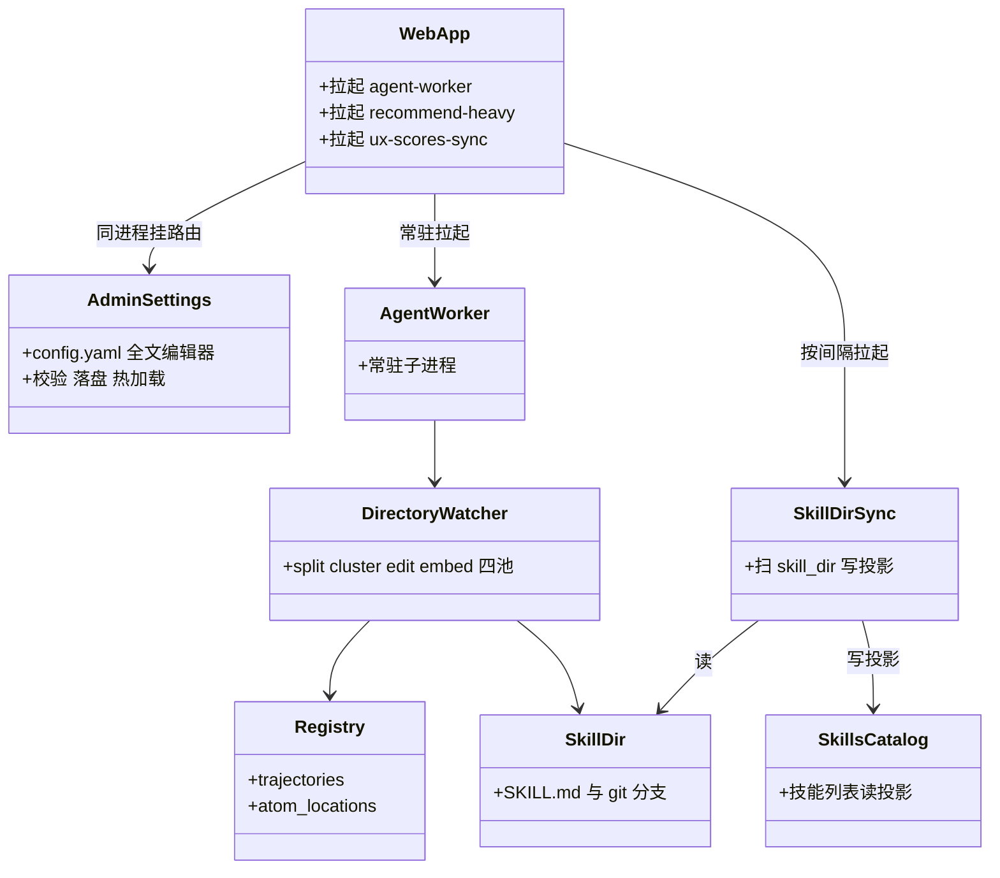
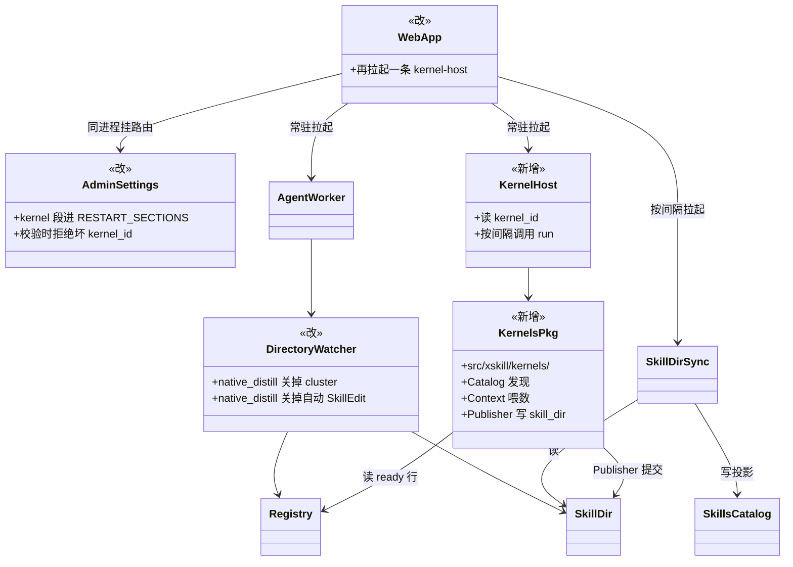
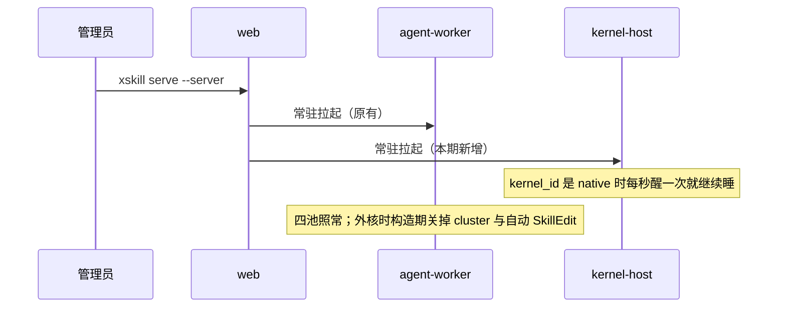
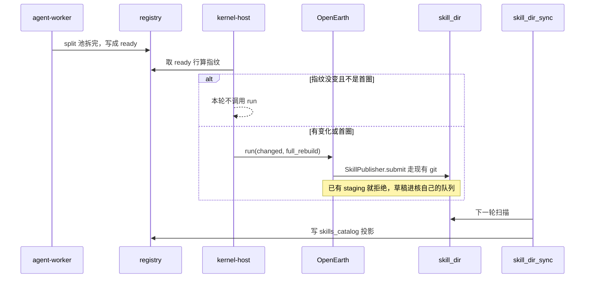

# 把算法内核与 OpenEarth 接到当前主干

对应 [issue #363](https://github.com/SkillNerds/xskill/issues/363)、[PR #364](https://github.com/SkillNerds/xskill/pull/364)。不要 rebase [PR #155](https://github.com/SkillNerds/xskill/pull/155)。

第一期只做两件事：主干多拉起一条 kernel-host，再放上 OpenEarth 目录。用户感知是「多了一个可切换的算法内核」，不是换一套蒸馏系统。换核卡片对齐 [#205](https://github.com/SkillNerds/xskill/issues/205)，第一期不做。

名词只在这里解释一次。算法内核：轨迹进站之后、Skill 发布之前可替换的那一层。Native Kernel：平台自带，id 为 `native`，真正干活的是拆分、归类、编辑三个代理。OpenEarth：第三方核，id 为 `openearth`。Atom：一条轨迹拆出来的原子任务。kernel-host：周期调用外部核 `run()` 的常驻子进程。agent-worker：主干上已有的常驻四池子进程。baby、staging、main：技能的预备分支、灰度分支、正式主干。

## 类图

Before 和 After 是同一张骨架。After 只多两个框，只圈五个点。没有标注的框就是不动。

### Before（当前主干）

### After（第一期）

OpenEarth 是 `~/.xskill/kernels/openearth` 目录，代码不进 `src`。`skill/git.py` 只加一个只读函数 `read_bundle_on_ref`。

选 OpenEarth 之后：split、embed、generate 继续。cluster 和自动 SkillEdit 必须停，否则归类代理会造 baby 占坑。不要把整个 edit 池人数调成 0。切核后 agent-worker 要重启才会停这两池，`kernel` 段按重启域标注。

不动的模块：atom 向量索引、`skill.catalog_store`、`recommend`、总览口径、看板前端、canary、llm 限流、`cli.py`、`scheduler.py`。不要把 demo 分支的 `utils/rate_limit.py`、`utils/llm.py`、`canary.py` 当换核的一部分搬过来。

## 时序图

第一期只留两条。

### 1. 启动时多一条 kernel-host

### 2. 轨迹拆完之后 host 调 OpenEarth

Publisher 只写 skill_dir 和 git。投影由现有 skill_dir_sync 下一轮补上。第一期 host 每轮读 ready 行与 atom JSON 算指纹，不打开 `traj_*.md` 正文；无变化就不调核。改读投影表放到以后再说。

## 用户怎么用

1. 按 OpenEarth README 安装 wheel，把目录拷到 `~/.xskill/kernels/openearth`。
2. 核自己的 `config.yaml` 只填 OpenCode。平台不读这份私有配置。核侧 benchmark 必须关，因为 host 每次启动第一圈是 `full_rebuild`。
3. 在现有设置页的全文编辑器里写 `kernel.kernel_id: openearth`，走已有的校验和 reload。写错会被 400 拒，旧核继续工作。

`xskill distill` 不是线上换核。`xskill generate` 与换核无关。

切核：继续用现有 yaml 编辑器。看失败：`~/.xskill/logs/xskill.log`。核自己 print 的内容第一期看不到，scheduler 把常驻子进程的 stdout 送了 DEVNULL。

设置页、400、成功提示和 `xskill.log` 长什么样，见 [第一期用户说明书](2026-08-27-openearth-first-user-guide.md)。当前主干的 `config.yaml.server.example` 还没有 `kernel` 段。

## 两块怎么合

1. 平台契约接线。搬 `src/xskill/kernels/` 六个文件：`__init__.py`、`base.py`、`builtin.py`、`catalog.py`、`context.py`、`runtime.py`。不搬 `distillation.py`。改 7 个文件，全是加法：`config.py`（kernel 段）、`api/app.py`（多一条 supervisor）、`_workers.py`（`run_kernel_host`，构造 watcher 时读一次 kernel_id）、`watcher_factory.py`（透传 `native_distill`）、`runner.py`（停 cluster 与自动 SkillEdit 的唯一落点）、`dashboard/console.py`（`RESTART_SECTIONS` 加 `kernel`，校验坏 kernel_id）、`skill/git.py`（只加 `read_bundle_on_ref`）。
2. OpenEarth 目录。`kernel.py`、README、wheel、`config.yaml.example`。从 #155 单独摘 full_rebuild 三分支、staging 排队、多 atom oracle，不 rebase 整支。README 按第一期用户说明书重写，不要原样搬 #155 里算法内核页、`xskill.kernel.log` 和 SSE 那一节。

## 不要做

不要 rebase 整条 #155。不要把短命 sweep 搬回来。不要把 demo 分支的限流、llm、canary 当换核搬过来。不要第一刀重写 TrajectoryReader。不要新开设置页卡片或 kernels API。不要在 web 里跑 OpenEarth。不要把空 changed 当成全量训练。不要把本机 Docker 或 `hub.xskill.wiki` 写成现网。

## 以后再说

设置页「算法内核」卡片和 `POST /admin/kernels/active`（#205）。`xskill.kernel.log` 和日志 SSE。总览只读当前核、流水线页写「外核已停」。TrajectoryReader 改读投影表，以及「无变化轮次不读全库 atom JSON」。#176 的 `create_temp`。`xskill distill --kernel`。

## 怎么算做完

serve 之后有 kernel-host，native 时不调核。设置页把 `kernel_id` 改成 `openearth`，写错被 400 拒、旧核仍工作。切核并重启 agent-worker 后，split 仍在跑，cluster 与自动 SkillEdit 停，generate 仍能排队。技能库出现 OpenEarth 提交的 main 或 staging。无变化轮次不调用核。`xskill.log` 里有 kernel-host 记录。现网等这两块合进主干并升级 server 之后，由用户在现网侧验收。
