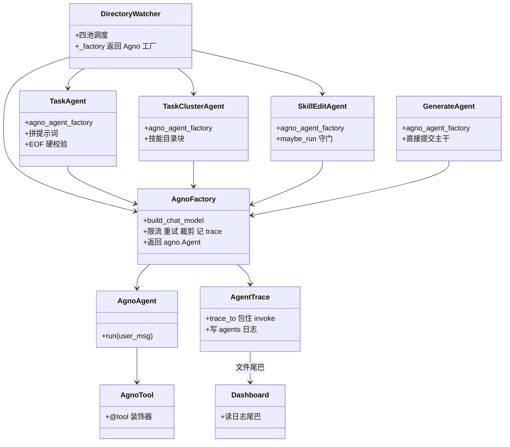
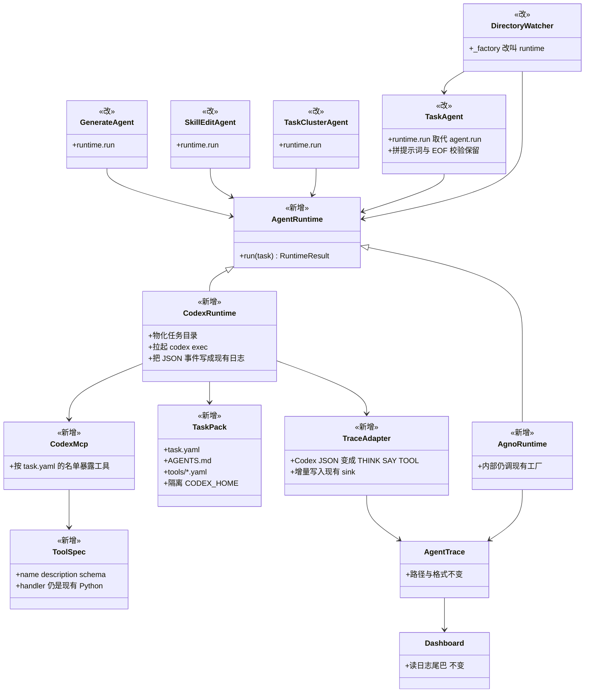
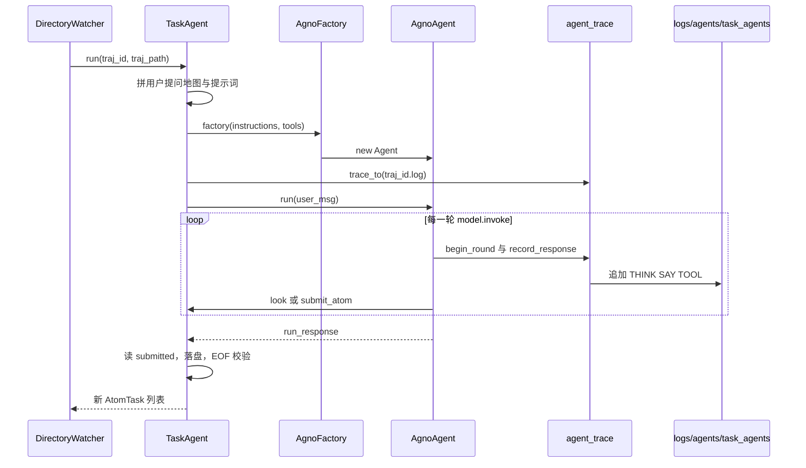
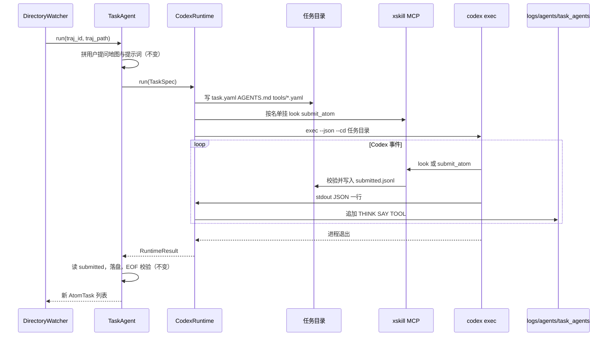
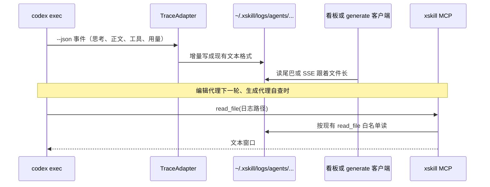
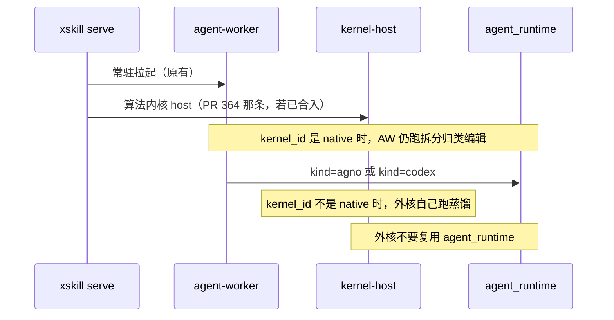

# 用 Codex 替换 Agno 作为蒸馏代理的执行内核

对照代码：GitHub `origin/main`（本文按 2026-09-01 的 `c7be097` 核对过工厂、工具和日志路径）。

实现时请把这件事当成一份给第三方看的设计：下面每个词第一次出现都会说明它是什么。代码位置是提示，不是必须先读完整个仓库才能动手。

## 这是什么

XSkill 平时从编码轨迹里自动蒸馏技能。蒸馏时会起好几类「蒸馏代理」：它们不是用户手里的 Claude Code 或 Codex，而是 XSkill 自己在后台跑的大模型循环。今天这些循环的执行框架是 Agno（一个 Python agent 库：它管模型调用、工具循环、重试）。本需求把这条执行框架换成 Codex CLI 的非交互运行（`codex exec`）。

换成 Codex 之后，每一个蒸馏任务不再是「在进程里 new 一个 Agno Agent 再 `agent.run()`」，而是先在磁盘上落下一个任务目录：里面有一份 yaml、一份给 Codex 看的说明、以及这份任务允许使用的工具描述。然后拉起一次 `codex exec`，让 Codex 在这个目录里干活。

蒸馏代理仍然是原来那几类，职责不变：

1. 拆分代理（TaskAgent）：把一条完整轨迹切成一段段原子任务（AtomTask）。
2. 归类代理（TaskClusterAgent）：决定某段原子任务该进哪个技能。
3. 编辑代理（SkillEditAgent）：候选材料够了以后，整理并写出 `SKILL.md`。
4. 生成代理（GenerateAgent）：用户点名、直接写主干，见 issue 215。
5. 手改吸收代理（UserEditAbsorbAgent）：用户手改技能文件后，把改动吸回主干。
6. 触发探针（trigger_probe）和描述优化（description_opt）：评「这段 description 会不会被编码代理点名」，也走同一套工厂。

本需求换的是「谁来跑大模型加工具循环」，不是「蒸馏算法换成另一套」。仓库里另外还有「算法内核」这条线（把拆分、归类、编辑整段换成 OpenEarth 一类外核，见 issue 363 与 PR 364）。那条线继续按自己的合入设计走。两边不要共用一个配置键，也不要共用一个类名。

本需求也不碰「把 Codex 用户会话收进来当轨迹」或「把技能装到 Codex 的 skills 目录」。那两件事已经在生态适配里做完了（`src/xskill/ecosystems/codex.py`、`docs/ecosystem/codex.md`）。

## 为什么换

Agno 现在同时做四件不该绑死在一个库上的事：选模型类、跑工具循环、在 `model.invoke` 外包限流与重试、把每一轮思维写进 XSkill 自己的代理日志。版本一变，工厂就要跟着改；工具必须写成 Agno 的 `@tool` 装饰器，测试只能靠注入假工厂。Codex 已经是仓库认过的编码代理运行时，非交互入口、JSON 事件流、MCP 外挂工具都现成。把执行框架换成它，蒸馏代理的提示词和工具校验可以留在 Python 里，循环本身交给 Codex。

## 用户和运维怎么开

默认继续走 Agno。现网、单机 `xskill serve`、team server 在配置改写之前，一条行为都不该变。

配置加一段，不要复用 `skill_generation` 或任何 `kernel_id` 字段：

```yaml
agent_runtime:
  kind: agno                 # 缺省。现网保持这个值
  # kind: codex
  codex:
    bin: codex               # PATH 里的可执行文件
    task_root: ~/.xskill/runtime/codex_tasks
    isolated_home: true      # 每次运行自带 CODEX_HOME，禁止写用户 ~/.codex
    inherit_user_config: false
    sandbox: read-only
    keep_packs: false        # true 时任务目录不删，方便对照日志
```

`kind: agno` 时，上面 `codex` 段可以不写。`kind: codex` 但机器上没有 `codex` 可执行文件，必须立刻失败，不要静默退回 Agno。

这一期没有新的用户命令。`xskill generate`、流水线拆分、看板看日志，对外入口都不变。

## 它在哪运行

蒸馏代理今天跑在 agent-worker 子进程的四个池里（split、cluster、edit、embed）。生成代理和编辑代理共用 edit 席位。换成 Codex 之后，调度还在这些池里：池里的线程不再调用 `agno.Agent.run()`，改为物化任务目录、拉起 `codex exec`、等它退出。

team 模式里，生成代理仍然只在 server 上跑。客户端还是瘦的：提交指令、阻塞读日志。不要把 `codex exec` 下放到员工电脑。

单机 `xskill serve` 和 team server 用同一套 `agent_runtime`。不要为两种部署各写一套内核。

## 现在怎么跑（Before）

以拆分一条轨迹为例。监听器（DirectoryWatcher，`src/xskill/pipeline/runner.py`）在 split 池里调用 `TaskAgent.run()`。TaskAgent 自己拼提示词、自己做行号校验，然后：

1. 调用 `make_task_agent_tools(...)`（`src/xskill/agents/agent_tools.py`）得到一批 Agno 工具。`submit_atom` 是闭包：合法提交写进线程本地的 `submitted` 列表。
2. 调用 `agno_agent_factory(instructions, tools)`。生产环境这个工厂来自 `src/xskill/agents/agno_factory.py`：按 `base_url` 选 DeepSeek 或 OpenAIChat，再在 `model.invoke` 外包限流、上下文裁剪、重试、以及 `agent_trace`。
3. 用 `trace_to(日志路径)` 包住 `agent.run(user_msg)`。每一轮 `model.invoke` 往日志里追加 THINK、SAY、TOOL。
4. `agent.run()` 返回后，TaskAgent 读 `submitted`，推导区间，落盘 AtomTask，再做「必须铺满到文件末尾」的硬校验。

归类、编辑、生成是同一形状：工厂加 `agent.run()`，副作用走工具，日志靠 `model.invoke` 外套。看板流水线页读这些日志的尾巴（`src/xskill/dashboard/pipeline_live.py`）。生成代理的客户端阻塞读的也是同一类文件（`src/xskill/team/server/generate_jobs.py`）。

日志落点已经固定，换执行框架不能改路径：

- 拆分：`<logs>/agents/task_agents/<轨迹id>.log`
- 归类：`<logs>/agents/task_cluster_agents/<轨迹id>/<原子id>.log`（批量是 `batch_<首个原子id>_n<个数>.log`）
- 编辑：`<logs>/agents/skill_edit_agents/skills/<技能名>.log`（同一技能多轮追加）
- 生成：`<logs>/agents/generate_agents/<用户id>/<任务id>.log`

`<logs>` 默认是 `~/.xskill/logs`（`xskill.config.LOGS_DIR`）。独立实例如果另指了 home，就用那个实例的 `logs_dir`，不要写死用户主目录。

## 换成 Codex 之后怎么跑（After）

Python 代理类还在。它们继续负责：什么时候触发、提示词怎么拼、工具参数怎么校验、跑完后磁盘上必须满足什么（例如拆分必须铺满到文件末尾）。它们不再持有 Agno Agent。

一次运行改成：

1. 代理把这次任务写成一个任务目录（folder）。
2. 目录里有 `task.yaml`（模型、工具名单、日志路径、可读根、超时）、`AGENTS.md`（系统提示词）、`prompt.md`（用户消息）、`tools/*.yaml`（每个工具的名字、说明、参数 schema）。
3. 工具的真实实现仍是现在的 Python 函数。任务目录只放描述。Codex 通过一个 XSkill 自己起的 MCP 服务调用这些函数。MCP 是 Model Context Protocol：让外部程序把工具挂到 Codex 上。
4. 运行器设置隔离的 `CODEX_HOME`（在任务目录里面，不在 `~/.codex`），带 `--ignore-user-config --skip-git-repo-check --sandbox read-only --json`，在任务目录里执行 `codex exec`。
5. 运行器读 Codex 打到标准输出的 JSON 事件，边收边写成上面那些现有日志文件。看板和 `xskill generate` 的流式输出继续读这些文件，不改协议。
6. 进程退出后，代理读工具留下的副作用（拆分读 `submitted.jsonl` 或内存列表，归类读 cluster 写入记录，编辑读 git 是否提交），再跑原来的硬校验。

Codex 的工作目录是任务目录，不是技能仓库，也不是轨迹目录。技能仓库和轨迹对 Codex 内置的 Read、Write、Shell 默认不可写。要读轨迹、要改 `SKILL.md`、要提交 git，必须走我们注册的工具。工具内部继续用现在的根目录白名单。

## 类图

### Before（当前主干）



### After（执行内核落地后）



字段名 `agno_agent_factory` 先留着也能跑：第一期可以让它变成「一个看起来像 Agno 的对象，`run()` 里面走 Codex」。稳定之后再改成 `runtime`。不要为了改名字先掀测试。

## 时序图

### 1. 现在：拆分一条轨迹（Agno）



### 2. 之后：拆分一条轨迹（Codex）



### 3. 日志怎么写、Codex 怎么再读



写日志的人是 XSkill 的 TraceAdapter，不是 Codex 自己爱写到哪算哪。Codex 的原始会话如果要留，只许落在任务目录里的隔离 `CODEX_HOME`，供排障。看板、生成客户端、人用编辑器打开的，永远是 `~/.xskill/logs/agents/...` 这一份。

读日志时 Codex 没有特权：它走现有 `read_file`。实现时把这次运行的 `logs_dir / "agents"` 加进该次任务的可读根。生成代理已经有 `extra_read_roots`，沿用即可。不要给通用 bash 去 `tail` 日志。

### 4. 和算法内核怎么错开（避免接错线）



## 每个任务的目录和 yaml

任务根目录由 `agent_runtime.codex.task_root` 决定，缺省 `~/.xskill/runtime/codex_tasks`。一次运行一个子目录，跑完按 `keep_packs` 决定删不删。

```
<task_root>/<kind>/<run_id>/
  task.yaml
  AGENTS.md
  prompt.md
  tools/
    look.yaml
    submit_atom.yaml
    ...
  state/
    submitted.jsonl          # 拆分代理用；其它 kind 按需
  workspace/                 # 只放这次要让 Codex 直接看见的摘录，可选
  codex_home/                # 隔离的 CODEX_HOME
```

`kind` 用现成的代理名：`task_agent`、`task_cluster_agent`、`skill_edit_agent`、`generate_agent`、`user_edit_absorb_agent`、`trigger_probe`。`run_id` 必须能对回日志文件，例如拆分就是轨迹 id，生成就是 `<用户id>/<任务id>`。

`task.yaml` 形状（拆分代理举例）：

```yaml
kind: task_agent
run_id: traj_cc_dsv4_890da9d9
model: deepseek-v4-flash
base_url: https://api.deepseek.com
timeout_seconds: 600
sandbox: read-only
cwd: /home/admin/.xskill/runtime/codex_tasks/task_agent/traj_cc_dsv4_890da9d9
logs:
  sink: /home/admin/.xskill/logs/agents/task_agents/traj_cc_dsv4_890da9d9.log
  append: false
  format: xskill-agent-trace
tools:
  - look
  - submit_atom
  - context_budget
  - my_atoms
read_roots:
  - /home/admin/.xskill/cc_sessions
  - /home/admin/.xskill/logs/agents
write_roots: []
blocked_read_roots: []
```

编辑代理的 `logs.append` 为 true，`write_roots` 仍为空：写技能文件走 `write_file` 与提交工具，不靠 Codex 直接改仓库。生成代理把团队轨迹根和技能仓库放进 `read_roots`，把 `blocked_read_roots` 里的 on hold 目录写进去，与现在 GenerateAgent 一致。

`tools/*.yaml` 只描述契约，不放实现。拆分的 `look` 可以是：

```yaml
name: look
description: >
  读轨迹某行附近的原文（含向前看，用来判断新意图还是追问）。
parameters:
  type: object
  required: [line]
  properties:
    line: {type: integer, description: 中心行号，从 1 起}
    before: {type: integer, default: 40}
    after: {type: integer, default: 20}
```

这些 yaml 是给人对账和 Codex 挂载用的。真正执行仍走 Python。参数校验失败时，工具返回 error 字符串让 Codex 自改，不要抛到进程外把整次运行打死（与现在 `submit_atom` 一致）。

`AGENTS.md` 写系统提示词，`prompt.md` 写这一次的用户消息。两份都由现有代理类生成，不要在运行器里另写一套提示词。

隔离 `CODEX_HOME` 是硬约束。用户机器上的 `~/.codex/sessions` 已经被 XSkill 当编码轨迹来源。如果蒸馏运行把会话写进那里，监听器会把一次拆分再收成一条新轨迹，再拆再收。任务目录和 `~/.xskill/runtime/` 都不要登记成 watch 目录。

## 给每个代理哪些工具

尽量复用 `src/xskill/agents/agent_tools.py` 里现成的函数，只换挂载方式。第一期不要新增业务工具。

拆分代理：`look`、`submit_atom`、`context_budget`、`my_atoms`；配了 interests 时加上 `mark_not_fit`。这些今天是闭包，状态在内存里。换 Codex 之后，MCP 往往在子进程，闭包过不去。拆分的提交记录改写到任务目录的 `state/submitted.jsonl`，校验所需的合法行号、续接点、用户块原文一并写进 `state/`。TaskAgent 在进程退出后读这份文件，后面的区间推导和 EOF 校验不用改。

归类代理（单条）：`atom_task_read`、`read_traj`、`skill_read`、`read_skill_tasks`、`new_skill_folder`、`add_task_to_skill`、`move_task_to`、`score_task`。批量把 `add_task_to_skill` 换成 `add_tasks_to_skill`。这些工具依赖 `AgentToolContext`（当前任务能看见的技能目录、轨迹根、registry）。MCP 进程必须在同一次运行里拿到同一份上下文，不要另起一份全局单例。

编辑代理：按现在各轮的名单挂，不要一次把所有提交工具都给它。baby 强制重写那一轮没有 commit 工具，只有读和 `write_file`。普通轮才有 `commit_baby`、`commit_baby_to_main`、`commit_to_staging` 里该轮允许的那一个。名单以 `SkillEditAgent` 里每次 `agno_agent_factory(..., tools=...)` 传入的为准。

生成代理：`list_files`、`grep_files`、`read_file`、`skill_read`、`write_file`、`edit`、`new_skill_folder`、`commit_generate_main`。不要给灰度提交工具，不要给通用 bash。

手改吸收代理：继续只给 `absorb_user_edit_to_main`。

不要给 Codex 内置 Shell 当「方便的后备」。现有代理明确禁止通用 bash。`sandbox: read-only` 是底线；若某版 Codex 仍暴露 Shell，提示词和 task.yaml 都要写禁止，测试要断言任务目录外没有被这个进程写过。

`src/xskill/skill/candidates.py` 里还有一条旧的 `_run_skill_edit_agent`，自己 `from agno.agent import Agent`。那是编辑代理的旧路径，不要在这条路上接 Codex，也不要再往里面加功能。新运行时只接 `SkillEditAgent`。

## 提示词怎么拼

提示词仍由各代理类拼。运行器只负责落到 `AGENTS.md` 和 `prompt.md`。

多写一段「你在 Codex 里跑」没有必要。工具名字、校验错误字符串、提交协议都保持原样，Codex 按工具说明做即可。

要补的只有和目录有关的三句，写在 `AGENTS.md` 末尾、由运行器追加，不改各代理自己的模板正文：

- 你的工作目录是这次任务目录。不要把这里的 yaml 抄进技能正文。
- 读轨迹、读技能、写技能、提交 git，只用工具列表里的工具。
- 需要看自己或其它代理上一轮怎么想的，用 `read_file` 打开 `task.yaml` 里 `logs.sink` 以及 `read_roots` 里的 `logs/agents`。

## 代理能看见什么、能改什么

只读：

- 该代理今天已经能读的那些根（轨迹目录、技能仓库、spill、团队轨迹）。换内核不能扩大。
- 新增：这次实例的 `logs_dir / "agents"`，让 Codex 按需读拆分、归类、编辑、生成日志。仍受现有 on hold 拦截。

可写：

- 技能仓库里的技能目录，而且必须走现有写工具与提交工具。
- 任务目录自己的 `state/`（工具实现写，不是让 Codex 直接改）。
- 禁止写 `.git/`、禁止写别人的 `~/.codex`、禁止写 watch 目录里的轨迹原文。

生成代理继续：不复用 `POST /api/v1/trajectories/search`，自己用 list、grep、read。

## 日志怎么写

今天的格式是给人看的文本，不是 JSON。每一轮大致是：

```
---- ROUND 1 | tokens=1.2k | spill@off | compact@off ----

THINK
...

SAY
...

TOOL  look(line=42)
TOOL RESULT  look
             Returned 2,401 chars.
```

`src/xskill/agents/agent_trace.py` 里的 `begin_round`、`record_response`、`event`、`append_to` 是这份格式的真源。Agno 路径继续走 `model.invoke` 外套。Codex 路径新增 TraceAdapter：把 `codex exec --json` 的事件翻译成同一套标记，再调用现有的 `append_to` 或与 `trace_to` 共用的写入函数。

要求：

1. 边收边写。生成代理的客户端和看板都在跟文件长度，不能等 `codex exec` 结束再整段落盘。
2. 编辑代理继续 `append=true`，同一技能多轮写同一个文件。
3. 重试、超时、进程非零退出，用现有 `agent_trace.event("WARN"|"ERROR", ...)` 写一行，便于和今天的限流重试日志对照。
4. token 用量如果 JSON 事件里有，记进 usage ledger（`src/xskill/usage.py`）。没有就显式不记，不要估一个数。
5. Codex 自己的 rollout JSONL 若保留，只放任务目录的 `codex_home/`。不要改名冒充 `agents/*.log`，看板解析不了。

读的方向见上面第 3 张时序图。人排障时既可以打开 `~/.xskill/logs/agents/task_agents/<轨迹id>.log`，也可以让下一次 Codex 运行用 `read_file` 读同一路径。两种读法看到的是同一份文件。

## 限流、重试、上下文变长

这三件事今天都挂在 Agno 的 `model.invoke` 上（`agno_factory.py`、`context_budget.py`）。换成 Codex 之后，单次 HTTP 调用发生在 Codex 进程内部，外套看不见每一轮 `invoke`。

第一期按下面收口，不要在 Codex 外面再做一套假的逐轮裁剪：

- 限流：拉起 `codex exec` 之前，用现有请求桶挡一层（按代理种类的 `llm_weight`）。这是「同时能跑几只 Codex」，不是「Codex 内部每分钟多少请求」。桶的语义写进配置注释，避免有人以为 RPM 还在逐轮生效。
- 重试：瞬时失败（429、5xx、进程被信号打死）由运行器对整次 `codex exec` 做有界重试，次数与退避沿用 `llm.max_retries` 那些字段。非瞬时失败（提示词、工具校验、EOF 校验）不重试。
- 上下文：交给 Codex 自己的压缩。`context_budget` 在 Codex 路径可以留着，读不到准确已用 token 时就如实返回「未知」，不要用字符数除以 4 假装精确。不要把 Agno 的 spill 再套到 Codex 的消息上。
- DeepSeek 必须回传 `reasoning_content` 的问题，今天靠 Agno 的 DeepSeek 子类。Codex 路径要在实现时用同一 `api.deepseek.com` 端点做一次多轮工具调用冒烟。若 Codex 丢了 reasoning 字段导致 400，记下并挡住 `kind: codex` 开到现网，不要靠猜。

## 跑完之后

对调用方，一次运行的结果仍是今天这些东西：

- 拆分：AtomTask 落在 `AtomTaskStore`，监听器更新 offset。
- 归类：`.candidates.yml` 有写入记录，atom 打上已归类。
- 编辑：baby 提交或灰度提交按原守门条件发生。
- 生成：主干上有提交，技能钉到发起人，客户端收到结束帧。
- 日志：对应 `agents/...` 文件存在，内容与这次工具调用一致；生成客户端跟到的文本与文件一致。

任务目录默认删除。失败且 `keep_packs` 为 true 时保留，路径写进代理日志的 ERROR 行，方便对照 `codex_home` 里的原始会话。

## 不要做的

- 不要改现网缺省。没人改 `agent_runtime.kind` 时，必须仍是 Agno。
- 不要把这次运行的 Codex 会话写进 `~/.codex/sessions`。
- 不要把 `~/.xskill/runtime/` 登记成轨迹 watch 目录。
- 不要给通用 bash，不要靠 Codex 内置 Write 改技能仓库。
- 不要把算法内核（OpenEarth、`kernel_id`、kernel-host）和执行内核配成同一个开关。
- 不要在第一期删 Agno 依赖，不要改 `pyproject.toml` 去掉 `agno`。
- 不要改日志路径，不要改看板和 generate 流式协议。
- 不要把 `--name`、on hold、技能写权限这些业务规则重写一遍。它们留在工具函数里。
- 不要走 `candidates.py` 那条旧编辑函数接 Codex。
- 不要在 Codex 路径上把 `min_samples` 或 jam 门槛改掉。那是灰度主裁的事，与执行框架无关。
- 不要为了「先跑通」把 `sandbox` 设成 `danger-full-access`，也不要加载用户家目录里那份 `~/.codex/config.toml`（本机开发者的 sandbox 经常是全开的）。

## 建议的改动面（给实现的人找文件用）

- 配置：`src/xskill/config.py` 的 `CONFIG_TEMPLATE` 与 `normalize_runtime_config`，新增 `agent_runtime` 段。
- 运行时接口：建议新包 `src/xskill/agents/runtime/`。`base.py` 放 `AgentRuntime` 与 `TaskSpec`；`agno_runtime.py` 包现有工厂；`codex_runtime.py` 物化目录并拉起进程；`task_pack.py` 写 yaml 与 `AGENTS.md`；`trace_adapter.py` 翻译 JSON 事件；`mcp_server.py` 按名单暴露工具。
- 工具脱 Agno：`agent_tools.py` 里的业务函数留下，`@tool` 变成可选的一层薄包装。先抽出 `ToolSpec`（名字、说明、JSON schema、handler），Agno 工厂从 spec 再包一层，MCP 从同一份 spec 挂载。
- 代理类：`task_agent.py`、`task_cluster_agent.py`、`skill_edit_agent.py`、`generate_agent.py`、`user_edit_absorb_agent.py` 只改「谁来 `run`」，提示词与校验不动。
- 监听器：`pipeline/runner.py` 的 `_factory()`，以及 `process_atom_task`、`process_atom_batch` 的工厂参数。
- 生成任务：`team/server/generate_jobs.py` 里构造工厂的地方。
- 探针与描述优化：`skill/trigger_probe.py`、`skill/description_opt.py`，放到拆分、归类、编辑都稳定之后的第二期。
- 单测：任务目录写入、yaml schema、TraceAdapter 用一段固定的 Codex JSON 事件回放成现有日志文本、MCP 工具名单过滤、隔离 `CODEX_HOME` 不出现在 `~/.codex/sessions`。Codex 进程用夹具可执行文件冒充，不要在普通 PR CI 里真拉模型。
- 文档：本文；`docs/agent.md` 只在实现落地后补一句「执行框架可换」，不要在设计阶段改用户手册口气。

## 怎么分步落地

第一期（本设计对应的实现 PR，可再拆）：

1. `agent_runtime` 配置与 `AgentRuntime` 接口。
2. 任务目录写入与 schema 单测。
3. TraceAdapter 回放单测。
4. 只把拆分代理接到 Codex 路径。归类、编辑、生成仍走 Agno。
5. 用夹具 `codex` 脚本证明：目录形状对、日志增量写到 `task_agents/<轨迹id>.log`、`submitted.jsonl` 能被 EOF 校验消费、用户 `~/.codex/sessions` 无新文件。

第二期：归类代理、编辑代理。编辑代理的多轮追加日志和「某一轮没有 commit 工具」必须先有单测。

第三期：生成代理（流式日志不能回退）、手改吸收。

第四期：探针与描述优化；评估是否还要保留 Agno 运行时。

每一期默认仍是 Agno。某一期要在测试机上开 `kind: codex`，写在该期 PR 的验证步骤里，不要改 CONFIG_TEMPLATE 的缺省值。

## 怎么算做完

设计本身：

1. 第三方只读本文，能分清「执行内核」「算法内核」「Codex 生态适配」三件事。
2. Before 与 After 类图能对上现在的类名和将要新增的模块。
3. 时序图能对上日志路径和「谁写、谁读」。

实现（后续 PR，不要和设计混成一个「做完」）：

1. 不改配置时，现有拆分、归类、编辑、生成单测全部仍过。
2. `kind: codex` 且 PATH 里没有 `codex` 时，拆分任务显式失败，不退回 Agno。
3. 拆分代理在 Codex 路径上：任务目录含 yaml 与 tools 描述；日志出现在 `logs/agents/task_agents/<轨迹id>.log`，格式仍能被看板尾巴识别（有 ROUND 或 THINK 或 TOOL 行）。
4. 同一次运行不在 `~/.codex/sessions` 下留下 rollout。
5. `submit_atom` 的非法行号仍返回 error 字符串，合法提交仍能通过 EOF 校验。
6. 生成代理接到 Codex 之后：客户端阻塞期间能看到增量日志，结束帧仍带技能名与是否提交主干。这一条属于第三期，第一期不必做。
7. 没有把 Agno 从依赖里删掉，没有改 jam 或 canary 门槛。
